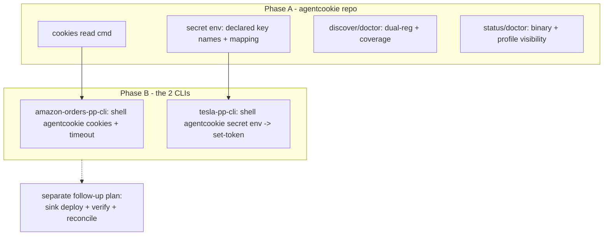
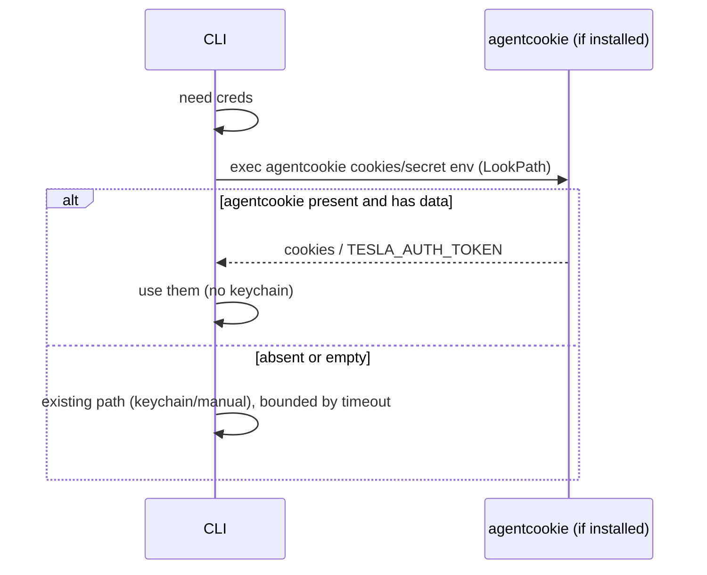

# feat: synced-credential consumption (agentcookie, then the two CLIs)

## Summary

agentcookie syncs cookies and secrets to the headless sink reliably, but consumers cannot use what was synced. Verified live on moltbot-mini: a fresh Amazon session sits in agentcookie's sidecar yet amazon-orders-pp-cli only knows the keychain path (which hangs headless), and Tesla's OAuth tokens reached the sink's secret store yet tesla-pp-cli reads `TESLA_AUTH_TOKEN` while the bus stored them under `OAUTH_BEARER` with nothing bridging the two. One root cause: agentcookie delivers to its own store and there is no generic, correct bridge into the shape each consumer reads.

This plan covers the first two phases in order: first agentcookie (the durable bridge every consumer uses), then the two affected CLIs (so they consume it). The third phase, deploying to the sink and verifying end to end, is deliberately left to a separate plan to be written after these two are built, when the deploy and verification steps can be grounded in what was actually shipped and learned.

Phase A and Phase B are separate PRs. Paths are repo-relative and prefixed with the target repo where the home repo (agentcookie) is not the target.

---

## Problem Frame

### Verified ground truth (from the sink, not theory)

- Sync works. Sidecar `~/.agentcookie/cookies-plain.db` is fresh and plaintext (sealing disabled). The secret store holds fresh Tesla tokens (OAUTH_BEARER 902 chars, OAUTH_REFRESH 1084 chars).
- Cookie consumption gap: ad-hoc-signed Go CLIs cannot be granted Chrome keychain access on macOS (documented in agentcookie `internal/sinkpush/adapter.go`), so they cannot read Chrome's store click-free and they do not read agentcookie's sidecar. Per-app adapters cover 19 of 1380 host keys.
- Secret consumption gap: on the sink, `~/.config/tesla-pp-cli/` does not exist and tesla-pp-cli `doctor` reports missing `TESLA_AUTH_TOKEN`. `agentcookie secret env tesla-pp-cli` emits `OAUTH_BEARER=...`, not `TESLA_AUTH_TOKEN=...`, so even the intended eval path does not authenticate the CLI.
- Dual registration: tesla-pp-cli is known to the bus two ways (pp-cli-derived from `.printing-press.json`, and an explicit secret store from `import-from auth.json`) with divergent key names, unreconciled. The laptop `config.toml` also has doubled token blocks.
- Footguns: the on-PATH binary (`~/go/bin/agentcookie`, stale) differs from the running daemon (`~/bin/agentcookie`), and nothing states which Chrome profile is the live synced one versus the intentionally-unsynced default.

### Design intent that shapes scope

agentcookie is for all cookies on all tools, not only printing-press CLIs. The read interface must stay universal (any tool, any domain). Only secret key mapping is necessarily printing-press-aware, because the consumer's expected key name comes from the CLI's published manifest; for non-PP tools, secrets pass through under their raw names.

---

## Requirements

- R1. Any tool reads synced cookies for a domain with one keychain-free call, no private import.
- R2. Synced secrets are exposable under the exact key name the consumer reads (emit `TESLA_AUTH_TOKEN`, not `OAUTH_BEARER`, when that is the declared key).
- R3. agentcookie surfaces dual registration and unmapped-secret coverage instead of silently shipping unusable data.
- R4. `status`/`doctor` flag the on-PATH vs running-daemon binary mismatch.
- R5. `status`/`doctor` state which Chrome profile is the live synced one vs the unsynced default.
- R6. amazon-orders-pp-cli can authenticate from synced cookies with no keychain prompt, falling back gracefully when agentcookie is absent.
- R7. tesla-pp-cli can authenticate from the synced secret, mapped to `TESLA_AUTH_TOKEN`.
- R9. The consumption contract is documented.

(The end-to-end deploy-and-verify on the sink, and reconciling the Tesla dual-registration on the box, are the separate follow-up machine plan, not this plan.)

---

## Key Technical Decisions

### KTD1: Consumption is shell-out, never import

Consumers cannot import agentcookie (`cli-printing-press` is public, agentcookie is private, a `private_dep_guard` test forbids it). The bridge is process-level, mirroring the existing press-auth shell-out: a CLI calls `agentcookie cookies ...` or `eval $(agentcookie secret env <cli>)`. agentcookie owns the interface; consumers shell to it.

### KTD2: agentcookie stays a soft dependency for consumers

CLIs try agentcookie and fall through to their existing path when the binary is absent (`exec.LookPath` like press-auth). No CLI hard-requires agentcookie. This honors the published-CLI constraint that generated tools must work without agentcookie reachable.

### KTD3: Read interfaces are keychain-free

Cookies come from the plaintext sidecar; secrets from the plaintext secret store. Neither read path touches Chrome's keychain, which is the whole point on a headless sink.

### KTD4: Key mapping is driven by the consumer's declared auth env vars

`secret env` emits under the names a CLI declares (`auth_env_vars` in `.printing-press.json`). When a synced secret cannot be mapped to a declared key, surface it loudly rather than emit an unusable variable. The authoritative mapping ultimately belongs in the per-CLI manifest (see Deferred).

### KTD5: Universal read, printing-press-aware enrichment

The read commands are universal (any tool, any domain). Only secret key naming is PP-aware; non-PP tools get raw-named passthrough. Cookies need no per-tool mapping at all.

### KTD6: CLIs are fixed by PRs to their own repos, patch-tracked

The two CLI changes are PRs to the tesla-pp-cli and amazon-orders-pp-cli repos, recorded in each CLI's `.printing-press-patches.json` so they survive regeneration. This is the normal per-CLI contribution path, not a throwaway hand-edit.

---

## High-Level Technical Design

### Sequenced phases and dependencies

### Consumption shape (shell-out, soft dependency)

Where prose and a diagram disagree, prose governs.

---

## Implementation Units

## Phase A: agentcookie consumption bridge (do first)

### U1. Keychain-free cookie read command

**Goal:** `agentcookie cookies --domain <d> [--json]` returns synced cookies for a domain from the plaintext sidecar.

**Requirements:** R1; KTD3, KTD5.

**Dependencies:** none.

**Files:** `internal/cli/cookies.go` (new), `internal/cli/root.go` (modify), `internal/cli/cookies_test.go` (new, test).

**Approach:** Read `pkg/sidecar.ReadSidecar(sidecar.DefaultPath())`, filter by host (`= d` or ends with `.d`, not a loose suffix), apply the sink's blocklist, emit a Cookie header by default or JSON with `--json`. Skip `agc1:`-sealed values with a clear note.

**Patterns to follow:** `pkg/sidecar/reader.go`; the blocklist filter in `internal/cli/sink.go`; subcommand registration in `internal/cli/root.go`.

**Test scenarios:**
- Happy path: `amazon.com` cookies returned; `--json` stable.
- Host scoping: excludes `amazon-adsystem.com` and `evilamazon.com`.
- Sealed values skipped, not emitted as garbage.
- Blocklisted domain filtered out.
- Empty/missing sidecar: empty output, exit 0, no stack trace.

**Verification:** `agentcookie cookies --domain amazon.com` returns the live session with no keychain dialog.

---

### U2. Secret env emits the consumer's declared key names

**Goal:** `secret env`/`get` emit synced secrets under the name the consumer reads, so `eval $(agentcookie secret env tesla-pp-cli)` sets `TESLA_AUTH_TOKEN`.

**Requirements:** R2; KTD4, KTD5.

**Dependencies:** none.

**Files:** `internal/cli/secret.go` (modify), the discovery reader that parses `auth_env_vars` (verify exact path; `internal/cli/discover.go` and backing package) (modify), `internal/cli/secret_test.go` (modify, test).

**Approach:** When a CLI declares auth env vars, emit those names via a stored-key to declared-key mapping. Map only when defensible; when no defensible mapping exists, do not invent one, pass unmapped keys through under stored names.

**Execution note:** Characterize current `secret env` output first, then change the emitted names.

**Patterns to follow:** pp-cli-derived discovery reading `auth_env_vars`; existing `secret env` eval-line format.

**Test scenarios:**
- Mapping applied: declared `TESLA_AUTH_TOKEN` with stored bearer emits `TESLA_AUTH_TOKEN=...`.
- No mapping: stored key with no declared target emitted under its stored name, not dropped.
- Ambiguous mapping emits none silently and reports (ties to U3).
- Eval-safety: output remains valid eval-able shell.
- Unchanged CLIs: already-matching keys emitted identically to before.

**Verification:** `eval $(agentcookie secret env tesla-pp-cli); tesla-pp-cli doctor` reports auth configured (on a machine with the CLI).

---

### U3. Surface dual registration and coverage

**Goal:** `discover`/`status`/`doctor` report when a CLI is registered multiple ways or its synced secrets do not satisfy its declared auth env vars.

**Requirements:** R3; KTD4.

**Dependencies:** U2.

**Files:** `internal/cli/discover.go` (modify), `internal/cli/status.go` and `doctor` (modify), corresponding tests.

**Approach:** Cross-check declared auth env vars against the union of stored keys after mapping. Prefer the declared shape when reporting. Do not auto-merge or delete; report.

**Test scenarios:**
- Dual registration flagged once, clearly.
- Covered CLI reports OK.
- Tesla-style uncovered CLI reports the specific missing key.
- Single-representation CLI: no false conflict.

**Verification:** `discover` and `doctor` name the Tesla mismatch explicitly.

---

### U4. Footgun visibility: stale binary and profile clarity

**Goal:** Flag the on-PATH vs running-daemon binary mismatch, and clarify live vs default Chrome profile.

**Requirements:** R4, R5.

**Dependencies:** none.

**Files:** `internal/cli/status.go` and `doctor` (modify), corresponding tests.

**Approach:** Resolve the running sink daemon's executable path, compare to the on-PATH `agentcookie`, warn on mismatch. Add a line naming the synced profile and labeling the default profile as intentionally unsynced.

**Test scenarios:**
- Mismatch -> WARN naming both paths.
- Match -> no warning.
- Profile line names synced profile and labels default as unsynced.
- No daemon running: degrades gracefully.

**Verification:** `doctor` on the sink emits the mismatch warning and the profile clarification.

---

### U5. Document the consumption contract

**Goal:** Write down how tools consume synced data.

**Requirements:** R9.

**Dependencies:** U1, U2.

**Files:** `docs/` consumption contract doc (new or extend secrets-bus/quickstart docs).

**Test scenarios:** `Test expectation: none -- docs unit.`

**Verification:** Doc states the keychain-free consumption path for cookies and secrets and links the press manifest requirement.

---

## Phase B: the two CLIs consume agentcookie (do second, after A)

### U6. amazon-orders-pp-cli consumes synced cookies

**Goal:** amazon-orders-pp-cli authenticates from synced cookies on a headless sink, with the keychain path bounded by a timeout and used only as fallback.

**Target repo:** amazon-orders-pp-cli (published CLI repo).

**Requirements:** R6; KTD1, KTD2.

**Dependencies:** U1.

**Files:** `internal/cli/auth.go` (modify), `internal/cli/auth_test.go` (modify/new), `.printing-press-patches.json` (record the patch).

**Approach:** In the auth flow, before the keychain path, try `agentcookie cookies --domain .amazon.com` via `exec.LookPath`. On success, use those cookies. On absence or empty, fall through to the existing chain, now wrapped in a context timeout so the keychain prompt fails fast instead of hanging.

**Execution note:** Add a failing test for the agentcookie-first ordering before wiring it.

**Patterns to follow:** the existing press-auth shell-out in the auth template; the timeout idiom already present in the auth code.

**Test scenarios:**
- agentcookie present with cookies: auth uses them, keychain never invoked.
- agentcookie absent: falls through to existing path unchanged.
- Keychain path times out: clear error within the bound, no infinite hang.
- Happy keychain path (cookies before deadline) unchanged.

**Verification:** On the sink, `amazon-orders-pp-cli auth login --chrome` authenticates from synced cookies with no dialog; with agentcookie removed from PATH it still behaves as before (bounded).

---

### U7. tesla-pp-cli consumes the synced secret

**Goal:** tesla-pp-cli obtains `TESLA_AUTH_TOKEN` from the synced secret on a headless sink.

**Target repo:** tesla-pp-cli (published CLI repo).

**Requirements:** R7; KTD1, KTD2, KTD4.

**Dependencies:** U2.

**Files:** `internal/cli/auth.go` (or the config/auth load path) (modify), test, `.printing-press-patches.json` (record the patch).

**Approach:** When no token is configured, source it from agentcookie: read `TESLA_AUTH_TOKEN` from `agentcookie secret env tesla-pp-cli` (which after U2 emits that name) and persist via the existing `set-token` bridge. Fall through to the current behavior when agentcookie is absent. Reuse the known auth-bridge pattern (the CLI already reconciles auth.json into config via set-token).

**Test scenarios:**
- agentcookie present with mapped token: CLI authenticates, `doctor` passes.
- agentcookie present but unmapped (pre-U2 names): CLI does not silently accept a wrong value; reports unconfigured.
- agentcookie absent: existing behavior unchanged.
- Token persisted via set-token, readable on next run.

**Verification:** On the sink, tesla-pp-cli `doctor` shows auth configured sourced from the synced secret.

---

## Phase C: the sink machine (separate plan, not in this one)

Deferred on purpose. After Phase A and Phase B are built, write a separate machine plan with `/ce-plan` to: deploy the current agentcookie binary to the sink (replacing the running `~/bin` copy and the stale `~/go/bin` one) and restart the LaunchAgent; install the two patched CLIs; verify amazon-orders and tesla-pp-cli both authenticate on the sink from synced data with no keychain prompt; and reconcile the Tesla dual-registration now that `doctor` (U3) names it. Planning it after the build means the deploy and verification steps reflect what actually shipped, not a guess.

---

## Risks and Dependencies

- **Wrong secret mapping authenticates with the wrong token.** Mitigation: KTD4, map only when defensible, surface gaps (U3), characterization test in U2.
- **Phase ordering.** B depends on A's commands existing. Do not start B before A's `cookies`/`secret env` land, or the CLIs shell out to commands that are not there yet. The machine plan depends on both and is written only after they are built.
- **Soft-dependency regressions.** The CLI changes must not break installs without agentcookie. Mitigation: KTD2, `LookPath` and fall through, tested explicitly.
- **Credential exposure.** The read commands surface decrypted data, but the plaintext sidecar and secret store already grant any local process the same access on a dedicated sink. Do not log values.
- **Tesla token semantics.** Confirm the synced bearer is the owner-api `TESLA_AUTH_TOKEN` and not only a Fleet token before mapping; U7 must report unconfigured rather than accept a wrong value.

---

## Scope Boundaries

### Deferred to Follow-Up Work

- Machine plan (separate `/ce-plan`, written after Phase A and B): deploy the current agentcookie binary to the sink, install the patched CLIs, verify both authenticate end to end on the box, and reconcile the Tesla dual-registration. See the Phase C note above.
- printing-press engine PR: emit a real agentcookie manifest per generated CLI with the key mapping, so the bus injects correctly without per-CLI guesswork and future CLIs consume automatically (the systemic version of Phase B).
- Cleanup of the doubled Tesla `config.toml` token blocks on the laptop (config hygiene).
- Auto-injection that writes a consumer's config directly (adapter generalization); the shell-out read interface is the chosen path.
- Retiring the per-app sinkpush adapters.

### Out of scope

- The sync path (works).
- Keychain access for ad-hoc-signed CLIs (proven impossible on macOS).
- Writing the user's default Chrome profile / browser-parity (a headless sink has no human browser).

---

## Alternative Approaches Considered

- **Skip Phase A, just patch the two CLIs to read the sidecar/secret store directly.** Rejected as the durable shape: every CLI would reimplement the read and couple to agentcookie's file formats. Phase A puts one stable interface in front of all consumers; the CLIs shell out to it. Direct-read stays a fallback option only if shell-out adoption proves insufficient.
- **Fix it all in the printing-press engine first (systemic), skip per-CLI PRs.** Rejected for sequencing: the engine change plus reprint is slower and does not unblock the two CLIs that are needed now. The engine PR is the deferred systemic follow-up; the per-CLI PRs ship the fix to the two that matter.
- **Keychain-clickfree so unmodified CLIs read Chrome directly.** Rejected and removed from an earlier draft: macOS does not durably grant ad-hoc-signed Go binaries keychain access, which is why the adapter model exists.

---

## Sources and Research

- Live sink session (moltbot-mini): `agentcookie status`/`doctor`/`discover`/`secret list`/`secret env`, tesla-pp-cli `doctor` (missing `TESLA_AUTH_TOKEN`), sidecar and secret-store contents, the `~/go/bin` vs `~/bin` binary split, dual Tesla registration, doubled `config.toml`, and the running LaunchAgent `dev.agentcookie.sink.plist`.
- agentcookie code: `internal/sinkpush/adapter.go` (ad-hoc keychain wall), `pkg/sidecar/reader.go` (plaintext reader), `internal/cli/sink.go` (blocklist, profile config), `internal/cli/secret.go` / `internal/cli/discover.go` (secret store, `auth_env_vars` discovery), `internal/cli/status.go` and `doctor`, `internal/chrome/keychain.go` (`SetSafeStoragePartitionList`, ad-hoc not covered), `internal/cli/root.go` (`Version`).
- CLIs: amazon-orders-pp-cli `internal/cli/auth.go` (press-auth shell-out precedent, keychain path, `.printing-press-patches.json`); tesla-pp-cli `spec.yaml`/`.printing-press.json` (`auth_env_vars: ["TESLA_AUTH_TOKEN"]`), the existing `set-token` auth bridge.
