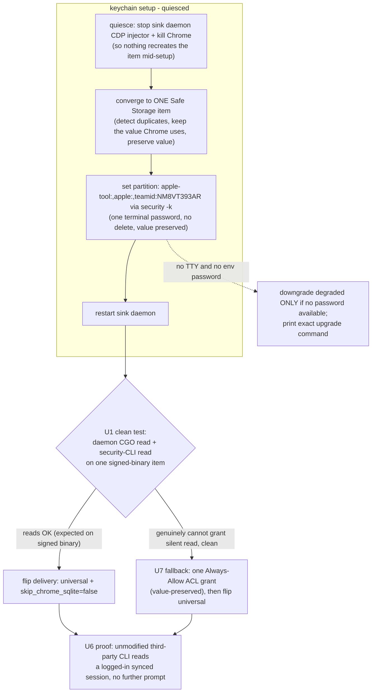

# fix: make universal cookie delivery actually land on a fresh sink (launch blocker)

## Summary

Agent Cookie's promise is that any unmodified cookie tool on a sink machine - the Polymarket CLI, yt-dlp, kooky, pycookiecheat, any printed PP CLI - reads your synced, logged-in Chrome session with zero per-tool work. The shipped v0.13 mechanism for this is sound on paper: set the Chrome Safe Storage keychain item's partition list to `apple-tool:,apple:,teamid:NM8VT393AR` with one login-password entry on the install terminal, no GUI click, no delete (so the encryption key value is preserved and existing cookies survive). The `apple-tool:` partition covers the `security`-CLI readers (yt-dlp, pycookiecheat, browser_cookie3, gallery-dl); `teamid:` covers Developer-ID-signed CGO readers including agentcookie's own daemon.

But on the live sink (moltbot-mini) it never actually lands universal: the config sits at `delivery: degraded` and the install downgrades. The root cause is not a macOS limitation - the Mini's daemon binary IS correctly Dev-ID signed (`NM8VT393AR`, hardened runtime), which is exactly the precondition `teamid:` needs. The root cause is a race: the sink daemon's CDP injector keeps relaunching Chrome, and Chrome recreates its own competing Safe Storage item. So the keychain ends up with more than one item, the partition is set on one while a reader hits the other, and the install's own verification read fails, triggering the silent downgrade to degraded. Last session's conclusion that "the partition is dead on macOS 15.x, only an Always-Allow click works" was reached during contaminated manual `-A` surgery against that duplicated, racing keychain - it was never a clean single-item test on the signed binary.

This plan makes universal delivery actually land on a fresh install, for every new user, with the fewest clicks possible (one terminal password, zero GUI clicks on the happy path). It does so by fixing the race and the silent-downgrade, then proving the result with an unmodified third-party CLI. It keeps the Always-Allow ACL-grant click strictly as a fallback, gated on a clean single-item partition test genuinely failing - a possibility the plan resolves empirically in its first unit rather than assuming.

Target repo: agentcookie (private, macOS-only, Go, Developer-ID signed NM8VT393AR).

---

## Problem Frame

### What "great" means here (P1)

A brand-new user installs agentcookie as a sink, logs into sites in Chrome on their laptop, and on the sink machine every unmodified cookie tool just works against the real Default Chrome profile - no per-tool config, no per-binary trust step, no "which profile" confusion. `agentcookie doctor` says `Cookie delivery: universal` and means it. That is the product. It is currently not delivered: a fresh sink lands degraded.

### Fewest clicks (P2)

The happy path is one login-password entry typed on the install terminal (the `security -k` call both authorizes the partition change and unlocks the SSH-locked login keychain). Zero GUI SecurityAgent clicks. macOS genuinely requires the login password to modify an existing item's access (`SecKeychainItemSetAccessWithPassword`) - zero entries is not achievable, one terminal entry is the floor. The fully non-interactive `AGENTCOOKIE_LOGIN_PASSWORD` env path exists for automation. The plan must not regress this to a GUI-click flow unless P1 cannot be met any other way.

### What the live evidence actually shows

- The Mini daemon binary is Dev-ID signed `NM8VT393AR` with hardened runtime - `teamid:` coverage applies to it. (Verified via `codesign -dv` 2026-05-31.)
- The shipped v0.13 inline partition path (`internal/cli/wizard_keychain.go` `runInlinePartitionAccess`) performs no delete and preserves the key value. (Code-confirmed.)
- The Mini config is `skip_chrome_sqlite: true` + `delivery: degraded` - universal never landed. (Verified.)
- The agent-native sidecar read works (`agentcookie cookies --domain .amazon.com` returns the Amazon token) - so sync and the degraded path are healthy; only universal delivery is missing. (Verified.)
- During install, the wizard printed `WARNING universal keychain open did not complete` and downgraded. (From the recovered session.)
- Manual `-A` experiments showed the Safe Storage item count bouncing back after each clean recreate, because Chrome (relaunched by the sink's CDP injector) recreated its own item. (From the recovered session.)

### The root cause, stated plainly

Universal delivery is failing because the keychain converges to more than one Chrome Safe Storage item under the sink daemon's Chrome-relaunch behavior, so the partition set and the subsequent read can land on different items, and the install treats the failed verification read as "universal didn't work" and silently downgrades. Fix the convergence-to-one-item + the verification/downgrade logic and the shipped one-password partition path lands universal on the signed binary.

---

## Requirements

- R1. A fresh `wizard install --as sink` on a signed binary lands `delivery: universal` (real Default profile + Chrome Safe Storage readable) with one terminal password and zero GUI clicks, whenever a login password is available (TTY prompt or `AGENTCOOKIE_LOGIN_PASSWORD`).
- R2. Universal works for unmodified third-party cookie tools: at minimum a `security`-CLI reader (apple-tool path) and a Dev-ID-signed CGO reader (the daemon). Proven live by an unmodified tool reading a logged-in synced session with no further prompt.
- R3. The Chrome Safe Storage keychain converges to exactly ONE item during keychain setup, and stays one, despite the sink daemon's CDP injector relaunching Chrome. Duplicate items are detected and collapsed, value-preserved.
- R4. The existing Safe Storage key value is never changed (no delete-and-recreate-with-new-value); existing Chrome cookies stay decryptable. Any path that would rewrite the value is refused with a clear message.
- R5. The install only downgrades to `degraded` when a login password is genuinely unavailable (no TTY and no env var) - never because a verification read transiently failed under the race. Downgrade prints the exact one-line upgrade command.
- R6. `doctor` reports universal vs degraded accurately, detects the multi-item race signature, and gives the exact remediation command.
- R7. The Always-Allow ACL-grant click path is available as an explicit, documented fallback, used only when the clean single-item partition test (U1) proves the signed-binary CGO read cannot be granted silently on the target macOS. It is never the default and never required on the happy path.
- R8. Docs reflect reality: the v0.13 runbook is corrected, and plans 002/003's zero-click-headless premise is retired in favor of the one-password (zero GUI click) reality plus the duplicate-item race.

---

## Key Technical Decisions

### KTD1: Resolve the partition-vs-click fork empirically in U1, do not assume it

The single most consequential question - does the shipped one-password partition path grant silent reads on a clean single-item, signed-binary setup on the target macOS - was never cleanly tested. U1 runs that exact experiment and records the result. Everything downstream branches on it: success routes to hardening the partition path (P2-optimal, one terminal password); a genuine clean failure routes to the U7 ACL-grant fallback. The plan is structured so it ships great either way, but it does not bet the product on an unverified assumption.

### KTD2: The race is the real bug, fix it at the source

Whatever the grant mechanism, a keychain that holds more than one Chrome Safe Storage item is broken: the partition/ACL gets set on one item and readers hit another. The durable fix is to quiesce the sink daemon's CDP injector and Chrome during keychain setup, converge to exactly one item (preserving its value), and only then set access. This fix is mechanism-independent and is the highest-leverage change in the plan.

### KTD3: Never rewrite the Safe Storage value (cookie-safety invariant)

Chromium derives the cookie AES key from the Safe Storage value via PBKDF2; changing it makes every existing cookie permanently undecryptable. All convergence and access changes must preserve the existing value: read-then-reuse, and if collapsing duplicates, keep the value of the item Chrome is actually using. Any code path that cannot guarantee value preservation must refuse rather than proceed. This is the one invariant that, if violated, wipes the user's cookies.

### KTD4: Verification failure is not a downgrade trigger

Over SSH the login keychain re-locks after the `security -k` call, so a same-session verification read can fail even when the partition is correctly set (the daemon reads it later in the GUI session). The install must not treat a failed in-session verification read as "universal failed" and downgrade. Downgrade is gated solely on password unavailability (KTD aligns with R5). Verification becomes advisory/diagnostic, not a control-flow gate.

### KTD5: One terminal password is the click floor; do not regress to GUI clicks

P2 is fewest clicks. The partition path's one terminal password (or env var) with zero GUI dialogs is the best achievable and must be preserved. The ACL-grant fallback (which needs a GUI Always-Allow) is strictly worse on P2 and is therefore fallback-only.

### KTD6: Idempotent, re-runnable install and a standalone repair command

Because real installs get interrupted (last session literally crashed mid-setup), the keychain-set path must be safe to re-run: detect current state (item count, partition contents, delivery marker) and converge, rather than assuming a clean start. A standalone `wizard set-keychain-access` re-run repairs a degraded or race-contaminated sink without a full reinstall.

---

## High-Level Technical Design

The two enabling edges are convergence-to-one-item (C) and password-gated-not-verification-gated downgrade. Once both hold, the shipped partition path lands universal on the signed binary. Where prose and the diagram disagree, prose governs.

---

## Implementation Units

### U1. Clean single-item partition verification on the signed binary (resolve the fork)

**Goal:** Settle empirically whether the shipped one-password partition path grants silent reads on a clean, single Safe Storage item with the Dev-ID-signed binary on the target macOS - the test that was never run cleanly. Its outcome selects U2-route (partition, default) vs U7-route (ACL fallback).

**Requirements:** R1, R2, R7; KTD1, KTD2, KTD3, KTD4.

**Dependencies:** none.

**Files:** none in-repo (runtime verification on the live sink); record the result in this plan's follow-up notes and in `docs/runbook-v0.13-one-password-keychain.md` as a verified/failed observation.

**Approach:** On moltbot-mini: quiesce the sink daemon's CDP injector and kill Chrome so nothing recreates the item; confirm exactly one Chrome Safe Storage item (collapse duplicates, value preserved per KTD3); run the shipped `wizard set-keychain-access` inline partition path with the login password; restart the daemon; then probe two independent read paths: the daemon CGO `SecItemCopyMatching` read (`teamid:` coverage) and a `security`-CLI read (`apple-tool:` coverage). Record which succeed with no GUI prompt. This is the decisive experiment; it changes no product code.

**Execution note:** This unit is a runtime experiment, not a code change - it belongs to the execution phase and gates the rest. Capture the before-state (item count, key length) and a rollback artifact (saved Safe Storage value) before touching the keychain, per the cookie-safety invariant.

**Test scenarios:** `Test expectation: none -- decisive runtime verification; the "pass" is a recorded, unambiguous read-path result with exactly one item present.`

**Verification:** A recorded result stating, for a single signed-binary item with the partition set: does the daemon CGO read succeed silently, and does the security-CLI read succeed silently. This selects the downstream route.

---

### U2. Quiesce + converge to exactly one Safe Storage item during keychain setup

**Goal:** Make keychain setup race-proof: stop the sink daemon's CDP injector and Chrome so nothing recreates the item mid-setup, detect and collapse duplicate Chrome Safe Storage items down to one (value-preserved), then restore the daemon. This is the root-cause fix and is mechanism-independent.

**Requirements:** R3, R4; KTD2, KTD3, KTD6.

**Dependencies:** none (lands regardless of U1 outcome).

**Files:**
- `internal/cli/wizard_keychain.go` (modify): wrap the access-set path (partition or fallback) in a quiesce/restore around the sink daemon's CDP injector + Chrome, and add a converge-to-one-item step that detects duplicate `Chrome Safe Storage` items and collapses to one, keeping the value Chrome actually uses and refusing if value preservation cannot be guaranteed.
- `internal/chrome/keychain.go` / `internal/chrome/keychain_partition.go` (modify): helpers to enumerate Safe Storage items, read the live value, and delete a duplicate while preserving the surviving item's value.
- `internal/cli/wizard_keychain_test.go` (modify), `internal/chrome/keychain_partition_test.go` (modify, test).

**Approach:** Reuse the existing one-shot LaunchAgent / daemon-control seams already in `wizard_keychain.go`. The converge step is the new logic: count items, identify the one with the value Chrome currently uses, delete the rest, never rewrite a value. Quiesce must be reliably reversible (restart the sink LaunchAgent in a deferred step even on error).

**Test scenarios:**
- Single item present: converge is a no-op; value unchanged; item count stays 1.
- Two items present (the race signature): converge collapses to 1, the surviving item's value equals the pre-converge value Chrome uses, and the deleted item is gone.
- Value-preservation guard: if the surviving value cannot be read, converge refuses and does not delete anything (no cookie-wipe risk).
- Quiesce/restore: after setup (success OR error), the sink daemon is running again and Chrome is not left killed.
- Re-run idempotency: running setup twice in a row leaves exactly one item and `delivery` unchanged on the second run.

**Verification:** After setup on a racing sink, exactly one Chrome Safe Storage item exists, its value is unchanged, and the sink daemon is healthy.

---

### U3. Land universal reliably; downgrade only on missing password, never on a failed verification read

**Goal:** Make the install actually flip to universal on success and stop the silent downgrade-on-verification-failure. Downgrade is gated solely on password unavailability and prints the exact upgrade command.

**Requirements:** R1, R5; KTD4, KTD5, KTD6.

**Dependencies:** U2.

**Files:**
- `internal/cli/wizard.go` (modify): after a successful access-set (partition set returned success), write `skip_chrome_sqlite: false` + `delivery: universal`. Decouple the `delivery` decision from the in-session verification read result; verification becomes advisory logging. Downgrade to degraded only when no password is available (no TTY and no `AGENTCOOKIE_LOGIN_PASSWORD`), printing the exact `wizard set-keychain-access` upgrade command.
- `internal/cli/wizard_keychain.go` (modify): `runInlinePartitionAccess` returns a clear "partition was set" success independent of `verifyPartitionRead` (which stays as advisory diagnostics, matching the SSH re-lock reality already noted in the code comments).
- `internal/config/config.go` (verify): `Delivery` marker round-trips (already covered by existing tests); no silent flip on binary upgrade.
- `internal/cli/wizard_test.go` (modify, test).

**Approach:** This is mostly control-flow correction: separate "did the partition set succeed" (the real gate) from "did a same-session read confirm it" (advisory, expected to fail over SSH). Reuse the existing password resolution (TTY prompt + env var) already in the wizard.

**Test scenarios:**
- Partition set succeeds, in-session verify read fails (SSH re-lock): delivery is set to `universal`, NOT downgraded. Covers the exact Mini failure.
- Partition set succeeds, verify read succeeds: delivery universal.
- No password available (no TTY, no env): lands degraded AND prints the exact upgrade command; does not error the install.
- Password via `AGENTCOOKIE_LOGIN_PASSWORD`: non-interactive universal, no prompt.
- Binary upgrade on an existing degraded sink: no silent flip; delivery unchanged until an explicit set-keychain-access run.

**Verification:** A fresh signed-binary install with a password lands `delivery: universal`; a fresh install with no password lands degraded with the upgrade command printed; neither path is decided by the flaky verification read.

---

### U4. doctor: accurate universal/degraded + duplicate-item race detection

**Goal:** `doctor` tells the truth about delivery and surfaces the race signature (more than one Chrome Safe Storage item) with the exact fix command, so a contaminated sink is diagnosable in one line.

**Requirements:** R6.

**Dependencies:** U2, U3.

**Files:**
- `internal/cli/doctor.go` (modify): the existing "Cookie delivery" check (around the `checkCookieDelivery` path) gains (a) a multi-item detection that warns when more than one Safe Storage item exists, naming the converge/repair command, and (b) remediation text pointing at the one-password set-keychain-access path rather than only `--any-app`.
- `internal/cli/doctor_test.go` (modify, test).

**Approach:** Reuse the existing keychain-probe and delivery-marker reads. Add the item-count signal. Keep the check non-fatal (INFO/WARN), per the existing pattern.

**Test scenarios:**
- Universal active (one item, partition set, real profile): check reports universal/OK.
- Degraded by config: reports degraded, not a failure, with the upgrade command.
- Multi-item race signature (>1 Safe Storage item): WARN naming the converge/repair command.
- Remediation text names the one-password path (not only `--any-app`).

**Verification:** `doctor` on a universal sink is green; on the current Mini it names the gap and the one-line fix; on a duplicated keychain it flags the race.

---

### U5. Make `set-keychain-access` a standalone idempotent repair

**Goal:** A degraded or race-contaminated sink is repaired to universal by re-running one command, without a full reinstall - the same quiesce + converge + partition-set + flip, idempotent.

**Requirements:** R1, R3, R5, R6; KTD6.

**Dependencies:** U2, U3.

**Files:**
- `internal/cli/wizard_keychain.go` (modify): ensure the `set-keychain-access` entry point runs the full U2 converge + U3 flip on its own and is safe to run repeatedly.
- `internal/cli/wizard_keychain_test.go` (modify, test).

**Approach:** Compose U2 + U3 primitives behind the existing command. No new surface; the command becomes the canonical repair path the downgrade message points to.

**Test scenarios:**
- Run on a degraded one-item sink with a password: lands universal.
- Run twice: second run is a no-op on item count and leaves delivery universal.
- Run on a duplicated keychain: converges to one and lands universal.

**Verification:** Re-running `set-keychain-access` on the current degraded Mini lands it universal with one item.

---

### U7. Fallback: one Always-Allow ACL grant (gated on U1 genuinely failing)

**Goal:** If and only if U1 proves the signed-binary CGO read cannot be granted silently via the partition on the target macOS, provide the one-time Always-Allow ACL-grant as the universal mechanism - value-preserved, with the single-click UX documented honestly.

**Requirements:** R2, R7; KTD1, KTD3, KTD5.

**Dependencies:** U1 (failure outcome), U2.

**Files:**
- `internal/cli/wizard_keychain.go` (modify): retain/repair the `--any-app` ACL-grant strategy as the gated fallback, corrected to preserve the existing value (read-then-reuse; refuse if unreadable) and to run after U2 convergence. Surface the one-time GUI grant instruction when agentcookie is not yet in the item ACL.
- `internal/cli/wizard_keychain_test.go` (modify, test).

**Approach:** This is the corrected v0.10-style path, but value-preserving and post-convergence. It is dead code on the happy path; it only activates when U1 forces it. Do not wire it as the default.

**Test scenarios:**
- Value preservation: after the ACL grant the item value equals the pre-grant value (cookie-safety).
- Read-blocked first run: if the value cannot be read, refuse to delete and return the one-time GUI-grant instruction.
- Gated: the default install path does not invoke this; it is reachable only via the explicit fallback flag/route.

**Verification:** On a sink where U1 failed, the ACL grant (one Always-Allow) lands universal with the value preserved.

---

### U6. Brand-new-user launch proof: unmodified third-party CLI reads a logged-in session

**Goal:** Prove the product promise end-to-end on a from-scratch install: a tool that knows nothing about agentcookie reads a real logged-in synced session from the real Default profile with no further prompt. This is the launch gate and corrects plans 002/003.

**Requirements:** R1, R2, R8.

**Dependencies:** U3 (and U7 only if the fallback route was taken).

**Files:** none in-repo (runtime launch verification); record the outcome and update `docs/runbook-v0.13-one-password-keychain.md`.

**Approach:** Simulate a brand-new user: wipe agentcookie and its keychain artifacts on the sink (not the machine, not unrelated secrets), reinstall as sink with one password, then run an unmodified third-party cookie tool that reads Chrome's Default profile + Safe Storage - at minimum a `security`-CLI reader (e.g. `yt-dlp --cookies-from-browser chrome` or a `pycookiecheat` one-liner) for a synced domain, and ideally a logged-in authenticated request. Confirm non-empty decrypted cookies and no GUI prompt. Note the tool used.

**Execution note:** Strongest form is an authenticated request returning a logged-in response, not just a non-empty cookie read.

**Test scenarios:** `Test expectation: none -- runtime launch verification.`
- Unmodified `security`-CLI tool returns non-empty decrypted cookies for a synced domain, no prompt.
- The real Default profile (not a separate profile) is what the tool reads.
- Strongest: an authenticated request with those cookies returns a logged-in response.

**Verification:** On a from-scratch sink, an unmodified third-party tool reads a logged-in synced session with no further prompt. This is the launch-day proof.

---

### U8. Docs: correct the runbook and retire the zero-click-headless premise

**Goal:** Documentation matches reality: one terminal password (zero GUI clicks) lands universal on a signed binary; the duplicate-item race and its fix are documented; plans 002/003's zero-click-headless claim is retired.

**Requirements:** R8.

**Dependencies:** U1 (final mechanism known), U3.

**Files:**
- `docs/runbook-v0.13-one-password-keychain.md` (modify): add the verified read-path result from U1, the duplicate-item race and the converge fix, and the password-gated (not verification-gated) downgrade behavior.
- `docs/plans/2026-05-31-002-feat-universal-cookie-delivery-plan.md` and `docs/plans/2026-05-31-003-test-universal-delivery-verification-plan.md` (modify): add a correcting note that the zero-click fully-headless premise (their R3) is false on macOS 15.x; the real floor is one terminal password with zero GUI clicks, and convergence-to-one-item is required.

**Test scenarios:** `Test expectation: none -- documentation.`

**Verification:** The v0.13 runbook reflects the verified mechanism and the race fix; plans 002/003 carry the correction.

---

## Risks and Dependencies

- **Cookie-wipe if a value is rewritten.** The single catastrophic risk. Mitigation: KTD3 value-preservation invariant enforced in U2 and U7, refuse-rather-than-rewrite, U1 captures a rollback artifact first.
- **U1 could prove the partition genuinely cannot grant silent CGO reads on macOS 15.x even clean.** Then the happy path needs the U7 ACL click (one GUI Always-Allow), a P2 regression but still a single click. The plan ships great either way; U1 resolves it before any default is wired.
- **Quiesce leaves the daemon or Chrome down.** Mitigation: U2 restore is deferred and runs on error; a test asserts the daemon is back up after both success and failure.
- **SSH keychain re-lock hides a real partition failure behind an expected verify failure.** Mitigation: KTD4 makes verify advisory and gates delivery on partition-set success + U6's independent third-party read as the real proof.
- **Headless box with no GUI session and no password.** Lands degraded by design (R5) with the upgrade command; not a launch blocker for the in-front-of-their-Mac new user.
- **Dependency:** the daemon binary must be Dev-ID signed for `teamid:` coverage - already true for the release/Mini binary (verified); the install should warn if it ever runs an unsigned binary (existing code already warns).

---

## Scope Boundaries

### Deferred to Follow-Up Work

- Tesla CLI secret-consumption proof (parked by the user); this plan is cookies-only.
- Any printing-press / per-CLI change - not needed; universal delivery is the point.
- Covering a truly arbitrary unsigned CGO tool beyond `teamid:`/`apple-tool:` (sign it, trust-list it, or use the U7 fallback) - documented boundary, not built here.
- Windows/Linux sinks.

### Out of scope

- Changing the sync path or the sidecar.
- Secrets bus behavior.

---

## Sources and Research

- Live probes on moltbot-mini (macOS 15.3.1), 2026-05-31: `codesign -dv` confirming the daemon binary is Dev-ID signed `NM8VT393AR`; config showing `skip_chrome_sqlite: true` + `delivery: degraded`; sidecar `cookies --domain .amazon.com` returning a real token; the recovered keychain-probe sequence showing the Chrome-relaunch race (item count bouncing back) and the `WARNING universal keychain open did not complete` downgrade.
- Shipped v0.13 code (PR #69/#70): `internal/cli/wizard_keychain.go` (`runInlinePartitionAccess`, `keychainStrategyMode`, `--any-app`/`--recreate` flags, one-shot LaunchAgent seams), `internal/chrome/keychain_partition.go` (`TeamPartitionList`, `buildPartitionListArgv`, codesign team resolution), `internal/cli/wizard.go` (password resolution + downgrade), `internal/cli/doctor.go` (`checkCookieDelivery`), `internal/config/config.go` (`SkipChromeSQLite`, `Delivery`).
- `docs/runbook-v0.13-one-password-keychain.md` (the one-password partition mechanism, what the partition covers, the SSH re-lock note, the no-password-available degraded path).
- Corrects: `docs/plans/2026-05-31-002-feat-universal-cookie-delivery-plan.md` and `-003` (zero-click headless premise).
