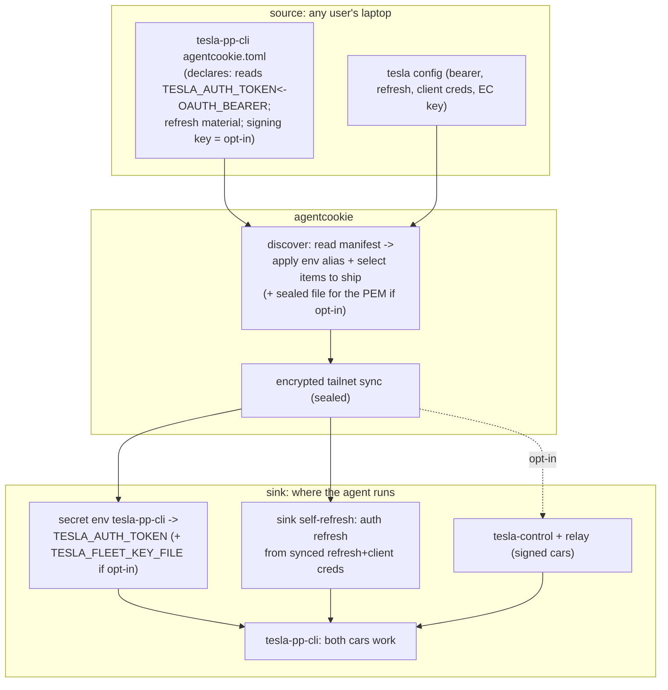

# feat: any agentcookie + tesla-pp-cli user gets a working Tesla on the sink, automatically

**Target repos:** `agentcookie` (private; discovery, aliasing, sealed-file sync) and `mvanhorn/printing-press-library` (public; `library/devices/tesla` manifest). Plan lives in agentcookie's private `docs/plans`.

## Summary

For any user who runs agentcookie and installs tesla-pp-cli from Printing Press, the Tesla CLI should authenticate and control their car(s) on the sink with zero manual steps, the same zero-ceremony promise the cookie side now has. Today it does not, and live testing this session pinned exactly why, in three layers:

1. Name mismatch: tesla-pp-cli reads `TESLA_AUTH_TOKEN`; agentcookie's bus exports the bearer as `OAUTH_BEARER`. The bridge is an `agentcookie secret alias`, which today is a manual, per-machine command.
2. Stale bearer: the bus carries a one-time snapshot of the bearer that expired (observed 8 days stale). The source CLI refreshes its own token independently and agentcookie never re-syncs the refreshed value, so the sink gets a dead token and the Fleet API returns 401.
3. Signed-command cars: a signed-command-required car (e.g. Snowflake) needs the EC signing key (`TESLA_FLEET_KEY_FILE`) and tesla-control on the sink. Plain REST returns 403 ("Vehicle Command Protocol required"). REST-only cars (e.g. Stella) work from the bearer alone.

All three were proven live this session: setting the alias made `discover` report `ok`; the bus token's expiry was May 23; Stella unlocked over REST and Snowflake unlocked only via the signed Fleet path once pointed at the key. This plan makes all three automatic for every user, not just this machine: agentcookie auto-aliases the Tesla bearer, the sink self-refreshes so the token never goes stale, and discovery provisions the signing path for signed-command cars (opt-in). No tesla-pp-cli auth code change is required; the CLI already reads `TESLA_AUTH_TOKEN`, `TESLA_FLEET_KEY_FILE`, and can `auth refresh`.

## Problem Frame

### Verified live (this session, 2026-05-31)

- tesla-pp-cli reads `TESLA_AUTH_TOKEN` (env) and `TESLA_FLEET_KEY_FILE` (signing key path), and has `command` (signed router), `auth refresh` / `auth fleet-refresh`, `doctor`, `reachability`. tesla-control is a separate binary it shells out to for signing.
- agentcookie's importer maps `access_token -> OAUTH_BEARER`, `refresh_token -> OAUTH_REFRESH` (secret import-from). `agentcookie discover` already detects tesla-pp-cli (pp-cli-derived, read-in-place from `config.toml`) and prints the exact alias fix when it sees the MISMATCH.
- `agentcookie secret alias tesla-pp-cli TESLA_AUTH_TOKEN OAUTH_BEARER` writes `~/.agentcookie/secrets/tesla-pp-cli/aliases.env` and makes `secret env` emit `TESLA_AUTH_TOKEN`. Confirmed: discover flipped MISMATCH -> ok.
- The synced bearer expired May 23 (`OAUTH_EXPIRES_AT`); the source CLI still works because it refreshes independently. So the bus value is stale.
- Two cars, one account: Stella (REST) unlocked from the bearer; Snowflake (signed) needed the key + signed Fleet path.
- No library CLI has an `agentcookie.toml` manifest yet; the v2 manifest format supports `[secrets.file]` + `[sync]` key filter. Env-var aliasing was added in U1 (shipped this session as PR #73; the `[aliases]` table).
- Source-shape finding (execution, this session): the `OAUTH_BEARER` key in the bus came from a one-time manual `secret import-from auth.json`, not anything automatic. The CLI's auth lives in `config.toml` (TOML) + `auth.json` (JSON), not an env-shaped file, and the automatic pp-cli-derived path points `[secrets.file]` at `config.toml` (TOML the env-reader cannot cleanly parse) and would not yield a stable `OAUTH_BEARER` for a fresh user. So a stable, automatic source key requires the tesla-pp-cli auth-export in KTD4/U2.

### What "for everyone" requires

- The bearer alias must be automatic (no per-user `secret alias` command).
- The bus must carry a token that stays valid: either re-synced on refresh or refreshable on the sink. Refreshable-on-sink is robust and source-independent.
- Signed-command cars need the signing key + tesla-control on the sink, provisioned by discovery, gated as opt-in because it places a command-signing key on the sink.
- All of it wired by `agentcookie discover` from a shipped manifest, so a fresh install Just Works.

## Requirements

- R1. On any sink with agentcookie + tesla-pp-cli + Tesla synced, `tesla-pp-cli` authenticates from the bus with no manual `secret alias`, `set-token`, or paste.
- R2. The bearer never goes stale on the sink: the sink can refresh its own Tesla bearer from synced refresh material, OR agentcookie re-syncs the refreshed bearer automatically. (Default: sink self-refresh.)
- R3. REST cars (e.g. Stella) read and command on the sink from the bearer alone.
- R4. Signed-command cars (e.g. Snowflake) read and command on the sink: the EC signing key is synced sealed (0600), `TESLA_FLEET_KEY_FILE` is auto-set, and tesla-control is present. This is opt-in per user (a signing key on the sink is a deliberate exposure).
- R5. Everything is auto-wired by `agentcookie discover` from a shipped `agentcookie.toml` in the Tesla CLI; no per-user agentcookie commands.
- R6. tesla-pp-cli's auth-read paths are unchanged (`TESLA_AUTH_TOKEN`, `TESLA_FLEET_KEY_FILE`, `auth refresh` all exist). The one additive CLI change is an auth-export: on auth/refresh, write an env-shaped 0600 secrets file the manifest points at, so the bus has a stable source for any user (see KTD4). Plus the `agentcookie.toml` manifest + docs.
- R7. Security posture is explicit and documented: which material lands on the sink (bearer always; refresh + client creds if self-refresh; signing key if opt-in), all sealed and tailnet-only.

## Key Technical Decisions

### KTD1: Declarative env aliasing in the manifest, not a per-user command or a hardcoded table

Extend the agentcookie v2 manifest with an env-alias declaration so a CLI declares "I read `TESLA_AUTH_TOKEN`, map it from `OAUTH_BEARER`," and `agentcookie discover` applies it automatically (writes/equivalents the alias) for every user. This generalizes beyond Tesla (any OAuth CLI can declare its env var) and avoids hardcoding Tesla into agentcookie. Alternative considered: a built-in known-CLI alias table in agentcookie (smaller, but Tesla-specific and non-extensible) - rejected as the default, may be a fallback.

### KTD2: Sink self-refresh is the durable token-freshness answer

Carry the refresh token + `client_id` + `client_secret` (sealed) so tesla-pp-cli on the sink runs its own `auth refresh` and re-mints the bearer when it expires. This is source-independent and robust, versus depending on the source to refresh-and-re-sync a short-lived bearer fast enough. The bearer is still synced for immediate use; refresh material is the durability layer.

### KTD3: Signing-key sync is opt-in, bearer/refresh is the default

The default "for everyone" makes reads + REST-car commands + token refresh work automatically (bearer + refresh material, sealed). Syncing the EC signing key for signed-command cars is opt-in, because it places a key that can command the car on a headless machine. A user with only a REST car never needs it; a user with a signed-command car opts in knowingly. The manifest declares the signing-key item as opt-in; discovery does not sync it unless enabled.

### KTD4: tesla-pp-cli writes an env-shaped secrets file so the bus has a stable source (the corrected source-of-truth)

Execution uncovered that this was the wrong assumption. The CLI's auth lives in `config.toml` (TOML, with a `[fleet]` block) and `auth.json` (JSON), neither of which is the `KEY=VALUE` env shape the bus reads in place. The `OAUTH_BEARER` key currently in the bus came from a one-time manual `secret import-from auth.json`, not from anything automatic; the automatic pp-cli-derived path points `[secrets.file]` at `config.toml` and would not produce a stable `OAUTH_BEARER` key for a fresh user. So there is no consistent source key for the U1 alias to map from.

The fix is a small, well-defined tesla-pp-cli change: on every successful auth/refresh, write an env-shaped secrets file (`~/.config/tesla-pp-cli/agentcookie.env`, mode 0600) at the `config.go` token-persist sites (`SaveTokens`/`SaveFleetTokens` already hold the bearer + refresh + client creds + expiry at 0600-write time). The manifest's `[secrets.file]` points at that file, so the bus carries stable keys for any user automatically, and U4's refresh material rides along.

**Decision (refined this session): export the CLI's OWN env var names, not the bus-generic ones.** Write `TESLA_AUTH_TOKEN` (the bearer), plus the exact names `auth refresh` consumes for the refresh token + `TESLA_FLEET_CLIENT_ID` / `TESLA_FLEET_CLIENT_SECRET`. Then the bus ships those verbatim and the sink CLI reads them with **no alias at all**, fewer moving parts, no mapping layer for Tesla. U1's `[aliases]` mechanism (shipped, PR #73) stays as the general fallback for CLIs that cannot change their own export, but Tesla does not need it. The CLI still reads `TESLA_AUTH_TOKEN`/`TESLA_FLEET_KEY_FILE` unchanged; the only new behavior is the additive auth-export write. Record the change in `library/devices/tesla/.printing-press-patches.json` per the repo convention.

### KTD5: Secrets-bus must carry multiline/file secrets (the PEM)

The bus is `KEY=VALUE`; the EC key is multiline. Resolve the carrier against the v1/v2 spec: native sealed-file item if supported, else base64-into-a-sealed-key that discovery materializes to a 0600 file under `~/.agentcookie/`. This is the one genuinely new agentcookie capability the signing path needs.

## High-Level Technical Design

Where prose and diagram disagree, prose governs.

## Implementation Units

### U1. Manifest env-alias support in agentcookie discover

**Goal:** Let an `agentcookie.toml` declare a consumer env var and the bus key it maps from, and have `discover` apply that alias automatically (no per-user `secret alias`).

**Requirements:** R1, R5; KTD1.

**Files:**
- agentcookie: `docs/spec-agentcookie-secrets-bus-v2-adoption.md` (extend grammar with an env-alias block), `internal/cli/discover*.go` + `internal/cli/secret*.go` (apply declared aliases the way `aliases.env` is applied today), tests in `internal/cli/secret_alias_test.go` / discover tests.

**Approach:** Add a declarative alias section to the manifest grammar (e.g. an `[env]`/alias mapping). On discover, when a manifest declares aliases, materialize them into the same `aliases.env` mechanism that already works, so `secret env` emits the mapped var. Reuse the existing alias application path; this unit is mostly spec + wiring discovery to it.

**Test scenarios:**
- A manifest declaring `TESLA_AUTH_TOKEN <- OAUTH_BEARER` makes `secret env <cli>` emit `TESLA_AUTH_TOKEN` after discover, with no manual alias command.
- discover reports the CLI `ok` (not MISMATCH) once the manifest alias is applied.
- A manifest with no alias block behaves exactly as today (no regression).
- Alias to a missing bus key emits nothing for that var (mirrors current behavior).

**Verification:** With the manifest present, a fresh `discover` makes `secret env` emit the mapped var and coverage shows `ok`, no manual command.

---

### U3. Sealed multiline/file secret carriage + sink materialization

**Goal:** Let the bus carry a multiline secret (the EC PEM) sealed, and have the sink materialize it to a 0600 file that `TESLA_FLEET_KEY_FILE` can point at.

**Requirements:** R4, R7; KTD5.

**Files:** agentcookie: `internal/...` secrets carry/seal + sink materialization path; `docs/spec-agentcookie-secrets-bus-v1.md` if the wire shape needs a note; tests.

**Approach:** Resolve native-file vs base64-into-sealed-key against the spec; implement the chosen carrier so a declared file item round-trips sealed and lands 0600 under `~/.agentcookie/`. Never write it world-readable or outside the agentcookie dir.

**Test scenarios:**
- A declared sealed file item round-trips: sink file content equals source, mode 0600.
- A non-opt-in install does not materialize the key.
- Tampered/oversized payloads are rejected, not written.

**Verification:** On a sink, an opt-in signing-key item materializes to a 0600 file with byte-identical content.

---

### U2. tesla-pp-cli auth-export + agentcookie.toml manifest (printing-press)

**Goal:** Give the bus a stable, automatic Tesla secret source and wire it. Two parts in `library/devices/tesla`: (a) an auth-export that writes an env-shaped 0600 secrets file on every successful auth/refresh, using the CLI's OWN env var names (per KTD4); (b) the `agentcookie.toml` manifest pointing `[secrets.file]` at that file, shipping the bearer + refresh/client-cred keys, and declaring the signing key as an opt-in sealed file mapped to `TESLA_FLEET_KEY_FILE`. Because the export uses native names, NO alias is needed for Tesla.

**Requirements:** R1, R2, R4, R5, R6; KTD4.

**Dependencies:** U3 (sealed-file carriage, for the opt-in signing-key item only; the bearer/refresh half needs nothing beyond shipped U1 + this unit). U1 (shipped) is the general alias fallback, not required for Tesla under native-name export.

**Files:**
- printing-press-library `library/devices/tesla/internal/config/config.go` (the auth-export: write `~/.config/tesla-pp-cli/agentcookie.env`, mode 0600, with `TESLA_AUTH_TOKEN` + the refresh-token + `TESLA_FLEET_CLIENT_ID`/`TESLA_FLEET_CLIENT_SECRET` under the exact names `auth refresh` reads, hooked into `SaveTokens`/`SaveFleetTokens`) + its test.
- `library/devices/tesla/.printing-press-patches.json` (create/update): record the auth-export customization per the repo convention.
- `library/devices/tesla/agentcookie.toml` (create): `[secrets.file]` -> the exported env file; `[sync]` shipping the bearer + refresh keys; opt-in signing-key item. No `[aliases]` needed (native-name export).
- `library/devices/tesla/SKILL.md` + `README.md` (modify): auto-connect note, signing-key opt-in, security note (edit `library/.../SKILL.md`, never the `cli-skills/` mirror).

**Approach:** Add the auth-export where the CLI persists tokens (mirror its existing config-write path; the keys mirror agentcookie's importer mapping so `OAUTH_BEARER` is the stable bus key). Then author the manifest against the extended v2 spec. The auth-export is the load-bearing fix that makes the source automatic for every user; the manifest is the wiring. First manifest in the repo; mirror the spec exactly.

**Execution note:** Confirm the CLI's token-persist path and the exact field names `auth refresh` consumes before finalizing the exported key set, so the bus carries what the sink needs to self-refresh (U4).

**Test scenarios:**
- The auth-export writes `agentcookie.env` (0600) with `OAUTH_BEARER` set to the live bearer after an auth/refresh; values match the CLI's own stored token.
- `agentcookie discover` parses the manifest, applies the alias (coverage `ok`, not MISMATCH), ships the refresh keys, and shows the signing-key item as opt-in (not shipped by default).
- A user with only the bearer/refresh (no opt-in) gets no signing-key item materialized.

**Verification:** After an auth/refresh, the exported env file exists with the stable keys, and `agentcookie discover` shows the Tesla mapping `ok` with the opt-in signing item listed, no error.

---

### U4. Sink self-refresh wiring

**Goal:** Ensure tesla-pp-cli on the sink refreshes its own bearer from synced refresh material when the bearer expires, so it never goes stale.

**Requirements:** R2.

**Dependencies:** U1, U2.

**Files:** mostly verification + docs; if the CLI needs the refresh creds in specific env/config names, the manifest (U2) maps them; confirm the CLI's `auth refresh` input contract from `library/devices/tesla/internal/config` during execution.

**Approach:** Confirm exactly what `auth refresh`/`fleet-refresh` reads (refresh token + client_id + client_secret, and where). Map those via the manifest so a sink `auth refresh` succeeds. Decide whether refresh is triggered on-demand by the CLI (it already auto-refreshes on expiry per the binary strings) or needs a scheduled nudge.

**Test scenarios:** `Test expectation: none -- runtime verification in U5.`
- With an expired bearer but valid synced refresh material, a sink read triggers a refresh and succeeds.

**Verification:** On the sink, an expired bearer self-heals via refresh and the read works.

---

### U5. End-to-end verification on a clean sink

**Goal:** Prove the product promise for a from-scratch user: agentcookie + tesla-pp-cli + Tesla synced, no manual steps, both car types work, and it survives bearer expiry.

**Requirements:** R1, R2, R3, R4, R7.

**Dependencies:** U1, U2, U3, U4.

**Files:** none in-repo (runtime verification on the live sink).

**Approach:** On the sink, with the manifest-driven wiring active and no manual alias: read each car; a REST-car command (Stella); opt-in the signing key and run a signed command (Snowflake); force/await a bearer expiry and confirm self-refresh restores reads.

**Test scenarios:** `Test expectation: none -- runtime launch verification.`
- No manual `secret alias` was run; `secret env` emits `TESLA_AUTH_TOKEN` from the manifest.
- Read on each car returns data; a Stella command executes.
- With signing opt-in, a Snowflake signed command executes.
- After bearer expiry, a sink read self-refreshes and succeeds.

**Verification:** A clean sink controls both cars from synced material with no manual steps and survives expiry.

---

### U6. Docs + security note (both repos)

**Goal:** Document the auto-connect behavior, the self-refresh, the opt-in signing-key sync, the full signed-command onboarding (the bundled `auth fleet-template` Vercel public-key host -> `vercel deploy --prod` -> `auth fleet-register` -> agentcookie opt-in key sync), and the security trade.

**Requirements:** R7.

**Dependencies:** U2.

**Files:** printing-press-library `library/devices/tesla/README.md`; agentcookie `docs/runbook-secrets-bus-adoption.md` + the v2 spec (alias + sealed-file additions); a one-line agentcookie.dev / README mention that device CLIs like Tesla auto-connect.

**Test scenarios:** `Test expectation: none -- documentation.`

**Verification:** A reader understands what lands on the sink, that signing-key sync is opt-in, and how refresh keeps it fresh.

## Scope Boundaries

### Deferred to Follow-Up Work

- Generalizing the manifest alias + sealed-file pattern to other OAuth/device CLIs (Tesla is the first adopter; the mechanism is built general in U1/U3).
- BLE/local-only command paths on the sink (this plan is the internet/Fleet path).

### Out of scope

- tesla-pp-cli auth logic changes (env reads + refresh already exist).
- Building new Fleet-app registration tooling: not needed. tesla-pp-cli already ships `auth fleet-template` (scaffolds a Vercel-deployable static site hosting the partner-app public key at `.well-known/appspecific/com.tesla.3p.public-key.pem`, optionally generating the EC keypair to `~/.tesla/<name>-private.pem`) plus `auth fleet-register`. The signed-command opt-in path documents this existing on-ramp; agentcookie does not reimplement it.
- Sending vehicle commands without the user's per-command intent (the CLI's `--send` gate stays).

## Risks and Dependencies

- **Security: material on the sink.** Default carries bearer + refresh + client creds; opt-in adds the signing key. All sealed + tailnet-only. Documented (R7, KTD3). A signing key on a headless sink can command the car; that is the opt-in trade.
- **Each user needs their own Tesla Fleet app + key.** agentcookie does not provision Tesla developer apps; it carries the user's existing material. Users without a registered app get reads only if their token allows; signed commands need their own app/key. Document clearly.
- **PEM carriage is new agentcookie capability (U3).** Resolve against the spec; never write the key world-readable or outside the agentcookie dir.
- **Refresh contract unknowns (U4).** Confirm exactly what `auth refresh` reads before mapping; the CLI auto-refreshes on expiry per the binary, but the input field names must match.
- **Two repos, ordering.** agentcookie U1/U3 must land before the printing-press manifest (U2) can use those features; sequence accordingly.

## Sources and Research

- Live verification this session (2026-05-31): alias flips discover MISMATCH->ok; bus bearer expired May 23; Stella unlocked over REST; Snowflake unlocked via signed Fleet path with `TESLA_FLEET_KEY_FILE` set; both cars located.
- agentcookie: `internal/cli/secret.go` (import-from mapping access_token->OAUTH_BEARER; alias command + aliases.env), `internal/cli/secret_coverage.go` + `doctor.go` (MISMATCH surfacing), `docs/spec-agentcookie-secrets-bus-v2-adoption.md` (manifest grammar, no alias today), `docs/spec-agentcookie-secrets-bus-v1.md`, `docs/runbook-secrets-bus-adoption.md`.
- tesla-pp-cli: `printing-press-library` `library/devices/tesla/internal/config/config.go` (`env:TESLA_AUTH_TOKEN`, `[fleet]` block, `TESLA_FLEET_KEY_FILE`); `command` signed router, `auth refresh`/`fleet-refresh`, `reachability`, `doctor`, tesla-control + relay.
- Memory: tesla-pp-cli auth bridge; Snowflake internet command path (`snowflake-pp` app, `~/.tesla/fleet-*`, signed vs REST); Tesla Fleet API pricing.
- Supersedes plan 007 (the one-file-manifest assumption, disproven live).
