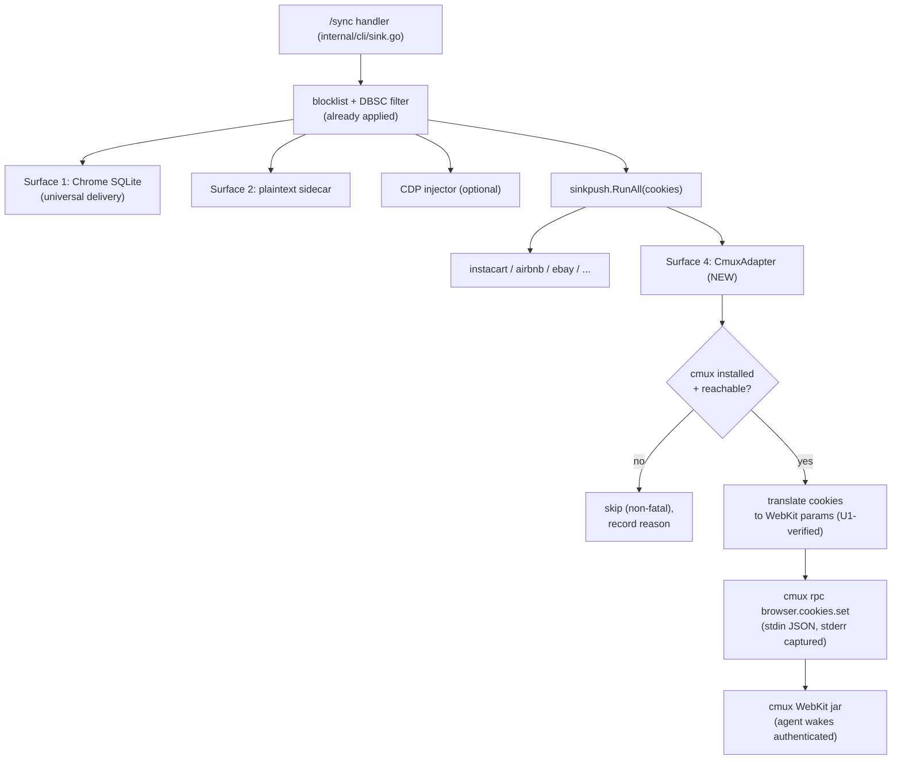

# feat: cmux WebKit cookie-delivery surface on the sink

## Summary

agentcookie already replicates a logged-in session to the sink and lands it on three delivery surfaces after every sync: the real Default Chrome profile (universal delivery), the plaintext sidecar, and the per-CLI adapters. cmux-based agent runtimes do not read any of those: cmux ships its own embedded browser on Apple WebKit (WKWebView), with a separate cookie jar (`~/Library/HTTPStorages/com.cmuxterm.app.binarycookies`) that none of the existing surfaces touch.

This adds a fourth delivery surface: a `sinkpush.Adapter` that, after every sync, injects the already-synced, already-decrypted, already-blocklist-filtered cookies into cmux's WebKit browser over the cmux control socket (`cmux rpc browser.cookies.set`). The result is the same promise agentcookie already makes for Chrome readers, extended to cmux: an agent driving cmux's browser wakes up authenticated, with no per-site login.

It rides the existing after-sync fan-out (`sinkpush.RunAll`), so there is no new sync trigger, no new timer, and no change to the source side or the transport. Cadence is inherited: whenever the source's Chrome cookies change, a sync lands and the cmux surface fires right after, seconds later.

---

## Problem Frame

The product promise is "your agent's browser is already logged in." cmux is a terminal Matt actually runs agents in, and its browser pane is WebKit, not Chromium. Today a cmux agent that opens a browser pane is logged out everywhere, because:

- cmux's cookie jar is a distinct WKWebsiteDataStore, separate from Chrome's SQLite store that universal delivery writes.
- cmux's own `browser import --from "Google Chrome"` is one-time and manual (a snapshot, not a sync), and it is unverified whether it decrypts Chrome 127+ App-Bound cookies at all - which is exactly the gap agentcookie already closes on the source side.

So agentcookie is the right home for continuous cmux session delivery: it already has the decrypted, filtered, DBSC-aware cookie stream on the sink. The only missing piece is a surface that writes that stream into cmux.

The operational catch, verified during investigation: cmux's RPC socket defaults to `socketControlMode: "cmuxOnly"`, which only accepts connections from processes started inside cmux. The agentcookie sink is a LaunchAgent and is not a cmux child, so a raw push is rejected ("Access denied - only processes started inside cmux can connect" / "Broken pipe"). This must be surfaced and remediated, not silently failed.

---

## Requirements

- R1. After every sink sync, push the synced cookie set into cmux's WebKit browser when the surface is enabled and cmux is reachable.
- R2. The surface is opt-in via sink config, defaulting off, and never breaks existing `sink.yaml` files.
- R3. Fail soft. A missing, stopped, or `cmuxOnly`-gated cmux is a skip, never a sync abort. One bad surface never blocks the other three.
- R4. Pass cookie values through verbatim. Never re-strip the App-Bound prefix (already stripped once on the source side).
- R5. Reuse the sink's existing blocklist filtering and DBSC handling. Do not re-solve either at the cmux layer.
- R6. Translate Chrome cookie records to WebKit-correct cookie parameters (domain, SameSite, Secure, expiry, session-scoping), verified empirically against `cmux rpc browser.cookies.set` rather than assumed from the CDP path.
- R7. Surface status and a one-line remediation in `agentcookie doctor`, including detection of the `cmuxOnly` gate. The surface also appears in `wizard verify-adapters` for free.
- R8. Never log cookie values. Record counts and outcomes only, consistent with the other surfaces.

---

## Key Technical Decisions

- KTD1. Implement as a `sinkpush.Adapter` (`internal/sinkpush/adapter_cmux.go`), not a new inline surface in the `/sync` handler. It plugs into the existing `sinkpush.RunAll(cookies)` call at `internal/cli/sink.go` with zero handler changes, and inherits blocklist filtering, the non-fatal contract, stderr logging, `sink-state.json` results, `doctor`, and `wizard verify-adapters`. (Alternative - a global CDP-style surface in `internal/cdp` - considered below.)
- KTD2. Source of truth is the in-memory `[]chrome.Cookie` slice handed to `Push(cookies)`, not the plaintext sidecar. The slice carries `SameSite`, `SourceScheme`, and `SourcePort`; the public sidecar reader drops SameSite. This supersedes the initial sidecar idea from scoping.
- KTD3. The surface wants the full synced set, so `CookieHostPatterns()` returns the configured `domain_filter` (anchored host matches) or `nil` to signal "every cookie" - the interface's documented full-set escape hatch.
- KTD4. Reuse the cookie-translation shape from `internal/cdp/setcookies.go` (`buildCookieParam`: domain de-dot, URL synthesis for SameSite correctness, `chromeSameSiteToCDP`, microseconds-since-1601 to Unix epoch, session-cookie preservation) but re-verify every rule against WebKit. WebKit's `WKHTTPCookieStore` historically wants the leading dot (opposite of CDP), and WebKit ITP may drop cross-site cookies more aggressively. A spike (U1) confirms the real contract before the adapter hard-codes it.
- KTD5. Value passthrough. `Push` sends `c.Value` unmodified. A test asserts no second App-Bound strip (the v0.12.0-beta.3 bug that caused a measured 64% cookie drop).
- KTD6. Binary resolution mirrors `internal/tsclient`: a `const cmuxAppCLI = "/Applications/cmux.app/Contents/Resources/bin/cmux"` with `exec.LookPath("cmux")` fallback and a typed not-installed signal feeding `IsInstalled()`.
- KTD7. The `cmuxOnly` gate is detected and remediated in `doctor`, not worked around in code. agentcookie does not silently flip a user's cmux security posture; it tells them to run the one-liner and restart cmux.

---

## High-Level Technical Design

Where the surface sits in the existing after-sync fan-out (the cmux box is the only new node):

The adapter is one of the `RunAll` participants; everything upstream of `RunAll` already exists.

---

## Implementation Units

### U1. Spike: confirm `browser.cookies.set` WebKit semantics

**Goal:** Resolve the WebKit-specific cookie contract empirically before the adapter encodes it, following the repo's `cmd/spike-*` precedent. Throwaway probe.

**Requirements:** R6 (informs), R1 (informs)

**Dependencies:** none

**Files:**
- `cmd/spike-cmux/main.go` (throwaway; removed or left as a documented probe before merge)

**Approach:** Drive `cmux rpc browser.cookies.set` / `browser.cookies.get` directly and record answers to the open questions:
- Does `browser.cookies.set` require a live browser `surface_id`, or can it target a profile / website-data-store without an open pane? (Observed in investigation: get/set accepted a `surface_id`.) If a surface is required, determine the lightest way the adapter ensures one (open a headless/background pane vs reuse an existing one) and whether the cookie persists to the profile after the pane closes.
- Leading-dot domain: does WebKit want `.example.com` or `example.com`? (CDP wants no dot; WebKit may be the opposite.)
- Exact param names/shape the RPC expects (name, value, domain, path, secure, httpOnly, sameSite encoding, expiry units).
- Session cookie handling (no expiry).
- Behavior under `cmuxOnly` vs `allowAll`/`password` (confirm the access-denied/broken-pipe signature for the doctor check).

**Execution note:** Spike to learn, not to keep. Capture findings in the U2/U3 approach and (post-merge) via `/ce-compound`, since there is no prior cmux institutional knowledge.

**Patterns to follow:** `cmd/spike-source/`, `cmd/spike-sink/`.

**Test scenarios:** Test expectation: none -- throwaway spike; its output is documented findings, not shipped behavior.

**Verification:** A short findings note answering each question above, with the confirmed param shape pasted into U2's approach.

### U2. CmuxAdapter implementing `sinkpush.Adapter`

**Goal:** The delivery surface: translate the synced cookie slice to WebKit params and push via the cmux socket, fail-soft.

**Requirements:** R1, R3, R4, R5, R6, R8

**Dependencies:** U1 (cookie param contract), U3 (config struct for filter/path/profile)

**Files:**
- `internal/sinkpush/adapter_cmux.go` (new)
- `internal/sinkpush/adapter_cmux_test.go` (new)
- `internal/sinkpush/init.go` (register `NewCmux()`)

**Approach:** Implement the `Adapter` interface:
- `Name()` -> stable identifier (e.g., `cmux`).
- `CLIBinary()` -> resolved cmux path (KTD6: const app path, LookPath fallback).
- `IsInstalled()` -> binary present (skips cleanly when cmux absent).
- `CookieHostPatterns()` -> configured `domain_filter` or `nil` for full set (KTD3); anchored host matching only (`= d` or ends-with `.d`), never loose suffix (the v0.11 `xopentable.com` vs `opentable.com` bug).
- `Push(cookies []chrome.Cookie)` -> for each cookie, build the WebKit param using the U1-confirmed contract (reusing the `internal/cdp/setcookies.go` mapping shape adjusted for WebKit), send via `exec` of `cmux rpc browser.cookies.set` with JSON on stdin and stderr captured into the wrapped error (mirror `adapter_instacart.go`). Value passed verbatim (KTD5). Treat an access-denied / broken-pipe (cmuxOnly) result as a returned error that `RunAll` logs and records, not a panic.

Decide in U1 whether one RPC call per cookie or a batch call is supported; prefer batch if available.

**Execution note:** Implement the cookie-translation and value-passthrough behavior test-first; these are the two historically bug-prone areas (SameSite/expiry mapping and double-strip).

**Patterns to follow:** `internal/sinkpush/adapter_instacart.go` (exec + stderr capture), `internal/cdp/setcookies.go` (`buildCookieParam`, `normalizeDomain`, `chromeSameSiteToCDP`, `cookieExpiresEpoch`), `internal/tsclient/tsclient.go` (binary resolution), `internal/sinkpush/validate.go` (runs before Push).

**Test scenarios:**
- Happy path: a slice of cookies (secure + non-secure, with and without expiry, varied SameSite) produces the expected WebKit param set; the exec target and stdin payload match expectations via a stubbed binary.
- Covers R4. Value passthrough: a cookie value longer than the App-Bound prefix length arrives byte-identical (no second strip); explicitly regression-guards the 64% drop.
- SameSite/Secure/expiry translation: Chrome `-1/0/1/2` map to the WebKit-correct values; microseconds-since-1601 expiry converts to the right epoch; `ExpiresUTC == 0` stays a session cookie.
- Leading-dot domain handled per U1 finding (dot present or stripped as WebKit requires).
- Host scoping: `domain_filter` of `opentable.com` matches `opentable.com` and `www.opentable.com` but not `xopentable.com`.
- Fail-soft: cmux binary absent -> `IsInstalled()` false -> `RunAll` skips (Skipped, reason "not installed"), no error. cmux present but RPC returns access-denied -> `Push` returns error, `RunAll` records FAIL, other adapters still run.
- Empty/filtered-to-zero set -> skipped with reason, no exec call.
- No cookie values appear in any log/error string (R8).

**Verification:** `go test ./internal/sinkpush/...` passes; with a stub cmux binary, a sync delivers the expected cookies and a missing/denied cmux is a clean skip/fail without aborting the run.

### U3. Sink config: `Cmux` surface options

**Goal:** Opt-in configuration for the surface, backward compatible.

**Requirements:** R2, R3, R5

**Dependencies:** none

**Files:**
- `internal/config/config.go` (add `Cmux CmuxRef` to `SinkConfig`; new `CmuxRef` struct)
- `internal/config/config_test.go` (load/validate cases)

**Approach:** Add `Cmux CmuxRef \`yaml:"cmux,omitempty"\`` to `SinkConfig`, mirroring `CDPRef`. `CmuxRef` fields: `Enabled bool`, `CmuxPath string` (override binary path), `TargetProfile string` (cmux profile/surface target, shaped by U1), `DomainFilter []string` (anchored host patterns; empty = all). Tilde-expand any path in `LoadSink`. Because the loader uses `KnownFields(true)`, the field must exist in the struct; `omitempty` keeps existing `sink.yaml` files valid (absent block -> disabled).

**Test scenarios:**
- A `sink.yaml` with no `cmux:` block loads with the surface disabled and no error (backward compat).
- A `cmux:` block with `enabled: true` and a `domain_filter` parses into the struct; tilde paths expand.
- Unknown sub-key under `cmux:` is rejected by `KnownFields(true)` (documents the contract).

**Verification:** `go test ./internal/config/...` passes; round-trips a representative `sink.yaml`.

### U4. Doctor: cmux delivery health category

**Goal:** Make the surface and its one operational gotcha visible and self-service.

**Requirements:** R7

**Dependencies:** U2, U3

**Files:**
- `internal/cli/doctor.go` (`checkCmuxDelivery`, appended in `buildReport` sink-only block; bump the category count in the command `Long`)
- `internal/cli/doctor_test.go` (cases)

**Approach:** Add `func checkCmuxDelivery(sinkCfg *config.SinkConfig) Check` mirroring `checkCDPInjector`:
- SKIPPED when the surface is disabled or this is a source-only install.
- OK when cmux is installed and the socket accepts a probe (e.g., a benign `cmux rpc` read) - meaning mode is not `cmuxOnly`.
- WARN/FAIL with remediation when cmux is installed but the probe hits the `cmuxOnly` access-denied signature: remediation text = set `automation.socketControlMode` to `allowAll` (or `password`) in `~/.config/cmux/cmux.json` and fully restart cmux (the mode is read only at app launch; `reload-config` does not apply it). Optionally point at the helper if one ships.
- WARN when cmux is not installed but the surface is enabled.
Append inside the existing `if sinkCfg != nil { ... }` block; bump the numbered count in the doctor `Long` description.

**Test scenarios:**
- Disabled surface -> SKIPPED.
- Source-only install -> SKIPPED.
- Enabled + cmux missing -> WARN with install guidance.
- Enabled + cmux present + cmuxOnly probe failure -> WARN/FAIL carrying the socketControlMode + restart remediation.
- Enabled + reachable -> OK.

**Verification:** `go test ./internal/cli/...` passes; `agentcookie doctor` on a sink shows the new line in each state.

### U5. Docs: fourth surface, setup, and the cmux gate

**Goal:** Document the surface as a first-class delivery option and the required cmux-side setup.

**Requirements:** R2, R7

**Dependencies:** U2, U3, U4

**Files:**
- `README.md` (delivery-surfaces section: add cmux as surface 4; note WebKit jar is separate from Chrome)
- `docs/quickstart.md` (opt-in `cmux:` block + the socketControlMode/restart prerequisite)
- `CHANGELOG.md` (entry)
- optional: `docs/runbook-cmux-delivery.md` if setup detail outgrows the quickstart

**Approach:** Explain that cmux is WebKit with its own jar, that the surface fires after each sync like the others, that it requires cmux's `socketControlMode` to be `allowAll` or `password` plus a one-time cmux restart (with the exact reason: mode is read at launch), and that DBSC/fingerprint-bound sessions (Google/Workspace) and WebKit ITP may not produce durable logins - sign in once in the cmux pane for those.

**Test scenarios:** Test expectation: none -- documentation only.

**Verification:** A reader can enable the surface and pass `agentcookie doctor` without external help.

---

## Scope Boundaries

In scope: the cmux delivery surface (adapter + registration), its config, its doctor check, and docs. Cookies only.

Outside this product's identity: any change to the source side, the transport, or the sync trigger; defeating DBSC; modifying the user's cmux security posture automatically.

### Deferred to Follow-Up Work
- Catch-up listener: subscribe to `cmux events` and do a full push when cmux starts or a browser pane opens, so a cmux that was down during a sync self-heals without waiting for the next source-side change. v1 fires after each sync and skips if cmux is down.
- localStorage / sessionStorage sync via `cmux rpc browser.storage.set` for sites whose session is token-bound (many SaaS) rather than cookie-only. v1 matches agentcookie's existing cookie-only model.
- A setup helper command (analogous to the standalone `setup_cmux.py` concept) to flip `socketControlMode` and prompt the restart, if the doctor remediation proves too manual.

---

## Risk Analysis & Mitigation

- The cmuxOnly gate makes the surface silently ineffective if undocumented. Mitigation: U4 doctor check with exact remediation; U5 docs; fail-soft so it never breaks sync.
- WebKit cookie semantics differ from CDP (leading dot, ITP cross-site dropping, SameSite defaulting). Mitigation: U1 spike confirms the real contract before U2 encodes it; tests assert the mapping.
- Double App-Bound strip regressing the 64% drop. Mitigation: KTD5 value passthrough + explicit regression test.
- Surface requires an open browser pane (unconfirmed). Mitigation: U1 resolves whether a pane is required and the lightest way to ensure one; if heavy, reconsider surface vs profile-level injection before U2.
- DBSC/fingerprint sessions will not persist in WebKit. Mitigation: inherit source-side DBSC flagging; set expectations in docs; no attempt to solve at this layer.
- Greptile reviews the PR. Resolve all findings before merge per project convention.

---

## Alternatives Considered

- Global CDP-style surface in `internal/cdp` instead of a `sinkpush.Adapter`. The "all synced cookies into a general browser" framing matches the CDP/global model conceptually. Rejected for v1 because the `sinkpush.Adapter` path is strictly less integration surface (zero `/sync` handler changes) and gets doctor + verify-adapters + state recording + fail-soft for free, while still delivering the full set via `CookieHostPatterns() == nil`. Revisit if the surface needs lifecycle behavior the adapter contract cannot express.
- cmux's built-in `browser import --from "Google Chrome"`. Rejected as the mechanism: it is one-time and manual, and it is unverified whether it decrypts Chrome 127+ App-Bound cookies - the exact gap agentcookie already closes. agentcookie delivering the already-decrypted stream continuously is the differentiated path.
- Reading the plaintext sidecar as the source of truth. Rejected per KTD2: the in-memory slice carries SameSite that the sidecar reader drops.

---

## Sources & Research

- cmux browser engine confirmed WebKit (links `/System/Library/Frameworks/WebKit.framework`); separate cookie jar at `~/Library/HTTPStorages/com.cmuxterm.app.binarycookies`; live `browser.cookies.set` round-trip verified during investigation (set + `document.cookie` readback).
- cmux `socketControlMode` enum and the cmuxOnly ancestry gate confirmed via `cmux capabilities` (`access_mode`) and a launchd-context reproduction; mode applies only at app launch (no live RPC, `reload-config` does not apply it).
- agentcookie extension point: `internal/sinkpush/` (`adapter.go`, `registry.go`, `init.go`), fired at `internal/cli/sink.go` `sinkpush.RunAll(cookies)`; cookie translation reference `internal/cdp/setcookies.go`; config `internal/config/config.go` (`SinkConfig`, `CDPRef`, YAML `KnownFields(true)`); doctor `internal/cli/doctor.go` (`checkCDPInjector`, `checkAdapterCoverage`); binary resolution `internal/tsclient/tsclient.go`.
- Hazards from repo history: App-Bound double-strip 64% drop (`docs/dry-run-2026-05-21.md`), unanchored host-match bug (`docs/runbook-v0.11-adapter-cookie-push.md`), keychain duplicate-item race and Safe Storage value-preservation invariant (`docs/runbook-v0.13-one-password-keychain.md`, `docs/plans/2026-05-31-005-...`), DBSC scope (`docs/threat-model.md`).
