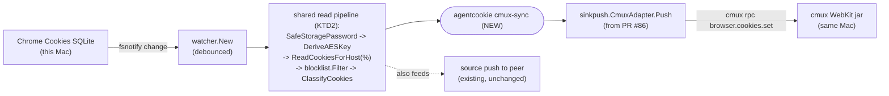

# feat: local loop - Chrome to cmux on one machine

Builds on PR #86 / `docs/plans/2026-06-03-001-feat-cmux-cookie-delivery-surface-plan.md`, which added the `CmuxAdapter` (the injection mechanism). This plan adds the missing piece: a same-machine loop that reads this Mac's Chrome and feeds that adapter, continuously and automatically, with no second machine, no Tailscale hop, and no pairing.

## Summary

agentcookie's two-machine model (source Mac browses, sink Mac receives) means the cmux delivery surface only fires on a separate sink. The actually-wanted shape is the local loop: on your daily-driver Mac, your Chrome logins flow into that same machine's cmux browser automatically, so a cmux agent on the machine you already use wakes up authenticated.

The read side already exists (the `source` command's Chrome decrypt + blocklist + DBSC filter) and the write side already exists (the `CmuxAdapter` from PR #86). This plan extracts the read pipeline into a shared helper and adds an `agentcookie cmux-sync` command that runs read -> filter -> inject locally, once or on an fsnotify watch. No transport, no sink, no peer.

Crucially, when run from inside cmux (a cmux child) the loop bypasses cmux's default `cmuxOnly` socket gate, so it needs no cmux restart and no socketControlMode change. A launchd option is documented for unattended autostart (which does need the socketControlMode change the doctor check already flags).

---

## Problem Frame

The cmux delivery surface added in PR #86 lives on the sink. On a one-Mac setup (the common case for "I want my terminal agent's browser logged in like my Chrome is"), there is no sink, so nothing delivers to cmux. Verified live this session: reading Chrome and injecting via the adapter works end-to-end (Amazon showed "Hello, Matt" in a cmux pane), but only because it was driven by hand. There is no shipped command that closes that loop automatically on one machine.

The loop is pure composition of code that already exists:
- Read: `chrome.SafeStoragePasswordFor` -> `chrome.DeriveAESKey` -> `chrome.ReadCookiesForHost(db, "%", key)` (App-Bound handled on read), then `protocol.NewBlocklistMatcher(bl).Filter(...)` and `chrome.ClassifyCookies(...)` for DBSC.
- Watch: `watcher.New(...)` (fsnotify on Chrome's Cookies file, debounced) as used by `source --watch`.
- Write: `sinkpush.CmuxAdapter.Push(cookies)` from PR #86.

What is missing is the glue command and a small refactor so the read pipeline is callable outside the source-push path.

---

## Requirements

- R1. `agentcookie cmux-sync --once` reads this machine's Chrome, applies the blocklist and DBSC filter, and injects the result into this machine's cmux browser via the `CmuxAdapter`, then exits.
- R2. `agentcookie cmux-sync --watch` runs the same pipeline continuously: on each debounced Chrome Cookies change, re-read and re-inject. `--once` and `--watch` are mutually exclusive, mirroring `source`.
- R3. Reuse the existing read pipeline (decrypt, blocklist, DBSC) rather than reimplementing it, so local and push paths cannot drift.
- R4. Opt-in domain narrowing via config and/or a flag; empty means the full set (after blocklist).
- R5. Fail soft: cmux not running or `cmuxOnly`-gated is a clear, non-fatal message, never a crash; `--watch` keeps running and retries on the next change.
- R6. No second machine, no transport, no pairing required. The loop works with only `source.yaml`'s Chrome/blocklist settings present (or sensible defaults), independent of any sink/peer config.
- R7. `agentcookie doctor` reports the local cmux loop's reachability (including the `cmuxOnly` gate) when the local loop is configured, not only in the sink role.
- R8. Never log cookie values. Counts and outcomes only.

---

## Key Technical Decisions

- KTD1. New dedicated command `agentcookie cmux-sync` (not a flag on `source`). `source` means "push to a peer sink"; overloading it with local injection would muddy that contract. (Confirmed with user.)
- KTD2. Extract the source read+filter pipeline (`ReadCookiesForHost("%") -> blocklist.Filter -> ClassifyCookies`) into one reusable helper, then call it from both `source` push and `cmux-sync`. This is the refactor that keeps R3 true.
- KTD3. Reuse the existing `CmuxRef` config struct. Add an optional `Cmux CmuxRef` block to `SourceConfig` (the local loop runs on the source machine; there is no sink.yaml there). Flags on `cmux-sync` (`--domain`, `--cmux-path`, `--browser`) override config.
- KTD4. Default run model is foreground / launched-from-cmux, which is a cmux child and so passes the default `cmuxOnly` gate with zero cmux changes. A launchd plist is documented for unattended autostart, which requires the socketControlMode change the PR #86 doctor check already prints. (Confirmed with user: support both, default docs to the from-cmux path.)
- KTD5. `--watch` reuses `watcher.New` (the same fsnotify+debounce wrapper `source --watch` uses), watching `cfg.Chrome.DBPath`. No new watch machinery.
- KTD6. The loop reads ALL cookies each cycle and injects the full current set (idempotent), consistent with the adapter's design and the persisted WebKit jar, so a missed change never leaves cmux permanently stale.

---

## High-Level Technical Design

The local loop reuses both ends; only the dashed box is new glue:

Same-machine, no network leg. The `source -> peer` path stays exactly as is and now shares the read pipeline.

---

## Implementation Units

### U1. Extract the shared Chrome read+filter pipeline

**Goal:** Factor the decrypt + blocklist + DBSC read pipeline out of the source-push path into one reusable function both callers use.

**Requirements:** R3

**Dependencies:** none

**Files:**
- `internal/cli/source.go` (extract the read+filter block currently inline near the push helper)
- a shared home for the helper: either `internal/chrome` (a `ReadFiltered`-style helper taking key + blocklist + DBSC options) or a small new `internal/localsync` package; decide during implementation based on import cleanliness (config/protocol/chrome dependency direction)
- the corresponding `*_test.go` for the new helper's home

**Approach:** Pull "read all cookies for key, apply `protocol.NewBlocklistMatcher(bl).Filter`, apply `chrome.ClassifyCookies(..., skipDBSC)`" into one function returning the filtered `[]chrome.Cookie` (plus the dropped-host/DBSC summary for logging). Rewire `source` to call it so behavior is unchanged. Watch the import direction: if the helper needs both `config` (blocklist type) and `chrome`, place it where neither cycle nor CGO-in-config rules are violated (config currently avoids importing chrome on purpose).

**Execution note:** Characterization-first - capture the current source read+filter output before extracting, so the refactor is provably behavior-preserving.

**Patterns to follow:** the existing inline pipeline in `internal/cli/source.go` (`ReadCookiesForHost(dbPath, "%", key)`, `NewBlocklistMatcher(...).Filter`, `ClassifyCookies(...)`).

**Test scenarios:**
- Happy path: a key + cookie set + blocklist yields the same filtered slice the inline source path produced (golden/characterization).
- Blocklist drop: a blocked host is excluded; a non-blocked host passes (anchored match, no loose suffix).
- DBSC: with skip=true, DBSC-suspect cookies are dropped; with skip=false they pass through (flagged).
- Empty/nil blocklist passes everything.

**Verification:** `source --once`/`--watch` behavior is unchanged; the helper has direct unit coverage.

### U2. cmux-sync config: local loop options

**Goal:** Configure the local loop without requiring sink.yaml.

**Requirements:** R4, R6

**Dependencies:** none

**Files:**
- `internal/config/config.go` (add `Cmux CmuxRef` to `SourceConfig`; reuse the existing `CmuxRef`)
- `internal/config/config_test.go`

**Approach:** Add `Cmux CmuxRef \`yaml:"cmux,omitempty"\`` to `SourceConfig`, mirroring the sink. Tilde-expand `CmuxPath` in `LoadSource` as done for other paths. `omitempty` keeps existing source.yaml valid (absent = local loop off). The `cmux-sync` command reads this block; flags override.

**Test scenarios:**
- A `source.yaml` with no `cmux:` block loads with the loop disabled, no error (backward compat).
- A `cmux:` block with `enabled`, `domain_filter`, and a tilde `cmux_path` parses and expands.
- Unknown key under `cmux:` is rejected by `KnownFields(true)`.

**Verification:** `go test ./internal/config/...` passes; representative `source.yaml` round-trips.

### U3. `agentcookie cmux-sync` command (once + watch)

**Goal:** The local loop command itself, both modes.

**Requirements:** R1, R2, R5, R6, R8

**Dependencies:** U1, U2, and the `CmuxAdapter` from PR #86

**Files:**
- `internal/cli/cmux_sync.go` (new cobra command, registered in `internal/cli/root.go`)
- `internal/cli/cmux_sync_test.go`

**Approach:** Add a `cmux-sync` cobra command mirroring `source`'s flag handling (`--once`/`--watch` mutually exclusive; `--domain`, `--cmux-path`, `--browser`, `--verbose`, `--dry-run`). Resolve config from `source.yaml` (Chrome path, browser, blocklist) plus the `Cmux` block, flags overriding. Build the key via `chrome.SafeStoragePasswordFor` + `DeriveAESKey`. Construct the adapter via `sinkpush.NewCmux(cmuxPath, domainFilter)`.
- `--once`: run the U1 helper, then `adapter.Push(cookies)`; print a one-line outcome (count pushed / skipped reason). cmux unreachable or `cmuxOnly`-gated -> clear non-fatal message naming the doctor remediation; non-zero exit only on a real error per the command's contract.
- `--watch`: see U4.
Reuse `source`'s blocklist load + DBSC flag plumbing. Never print cookie values (verbose prints names/counts only).

**Execution note:** Implement `--once` test-first against a faked adapter and a faked Chrome reader so the wiring (config resolve -> read -> filter -> push, and the fail-soft message) is covered without a live cmux or Chrome.

**Patterns to follow:** `internal/cli/source.go` (flag wiring, `--once` path, dry-run/verbose), `internal/cli/sink.go` (how the adapter is constructed and results logged), `internal/sinkpush/adapter_instacart.go` (exec/stderr conventions inherited by the adapter).

**Test scenarios:**
- Happy path (`--once`): given a faked reader returning N cookies and a faked adapter, the command resolves config, pushes N, and reports the count.
- Domain filter from flag overrides config; empty = full set.
- Mutually-exclusive flags: passing both `--once` and `--watch` errors; passing neither errors (mirror source).
- Fail-soft: adapter returns a `cmuxOnly`/connection error -> command prints the remediation, does not panic; `--dry-run` performs read+filter but no push.
- No cookie values appear in verbose output or errors.

**Verification:** `agentcookie cmux-sync --once` from inside cmux injects the current Chrome session and the cmux browser shows logged-in; `--dry-run` reports counts without touching cmux.

### U4. Continuous watch mode

**Goal:** Automatic re-injection whenever Chrome cookies change.

**Requirements:** R2, R5

**Dependencies:** U3

**Files:**
- `internal/cli/cmux_sync.go` (watch branch)
- `internal/cli/cmux_sync_test.go`

**Approach:** In `--watch`, construct `watcher.New(watcher.Config{...})` over `cfg.Chrome.DBPath` (mirror `source --watch`), and on each debounced event run the same `--once` pipeline (read -> filter -> push). Log one line per cycle (pushed/skip/err). A failed cycle (cmux down) logs and continues; the next change retries. Honor context cancellation for clean shutdown.

**Test scenarios:**
- A simulated watcher event triggers exactly one read+filter+push cycle.
- A push error in one cycle is logged and does not stop the watcher; a subsequent event still triggers a cycle.
- Context cancel stops the loop cleanly.

**Verification:** `agentcookie cmux-sync --watch` from inside cmux; logging into a new site in Chrome results in that session appearing in cmux within the debounce window, hands-free.

### U5. Doctor: local cmux loop reachability

**Goal:** Surface the local loop's health and the `cmuxOnly` gate from the source machine, not just the sink.

**Requirements:** R7

**Dependencies:** U2

**Files:**
- `internal/cli/doctor.go` (generalize the PR #86 `checkCmuxDelivery` to accept the cmux config + enabled flag from either role; run it when `source.yaml` has `cmux.enabled`)
- `internal/cli/doctor_test.go`

**Approach:** Refactor `checkCmuxDelivery` to take the resolved `CmuxRef` (and a label) rather than a `*SinkConfig`, so it can be invoked for the sink surface and for the source-side local loop. In `buildReport`, when source config has `cmux.enabled`, add the check. Same severity logic: SKIPPED when disabled, WARN when cmux missing or socket unreachable / `cmuxOnly`, OK when reachable. Reuse `probeCmuxAccessMode`.

**Test scenarios:**
- Source role with `cmux.enabled` and a `cmuxOnly` probe -> WARN with socketControlMode+restart remediation.
- Source role, loop disabled -> SKIPPED.
- Sink role behavior from PR #86 is unchanged (regression).

**Verification:** `agentcookie doctor` on the source machine shows the local cmux loop line with the right state and remediation.

### U6. Docs: the local loop

**Goal:** Document the local loop as the primary single-machine path.

**Requirements:** R6, R7

**Dependencies:** U3, U4, U5

**Files:**
- `README.md` (local loop section: one Mac, `cmux-sync --watch`, the from-cmux run model that needs no cmux change, and the launchd option that needs socketControlMode allowAll/password)
- `docs/quickstart.md` or a short `docs/runbook-cmux-local-loop.md`
- `CHANGELOG.md`

**Approach:** Explain the one-machine framing (no sink/peer needed), the two run models (foreground/from-cmux vs launchd) and which needs the socketControlMode change, the cookies-persist-profile-wide behavior, and the DBSC/ITP caveats inherited from PR #86. Make clear `source.yaml`'s blocklist still applies.

**Test scenarios:** Test expectation: none -- documentation only.

**Verification:** A reader on one Mac can enable and run the local loop from the docs alone.

---

## Scope Boundaries

In scope: the `cmux-sync` command (once + watch), the shared read-pipeline refactor, source-side cmux config, the doctor generalization, and docs.

Outside this product's identity: changes to the source->sink transport or pairing; defeating DBSC; auto-flipping cmux's socketControlMode.

### Deferred to Follow-Up Work
- A launchd installer for the local loop via `agentcookie wizard` (v1 documents the plist; wizard automation is follow-up).
- localStorage/sessionStorage sync (carried over from PR #86's deferred list).
- Auto-managing cmux's socketControlMode for the unattended/launchd case (today: doctor remediation + manual change).

---

## Risk Analysis & Mitigation

- The refactor (U1) could change source push behavior. Mitigation: characterization-first; source tests stay green.
- launchd run model hits `cmuxOnly` (not a cmux child). Mitigation: default docs to the from-cmux model; doctor flags the gate with remediation; fail-soft so it never crashes.
- Keychain access for the Chrome read. On the user's own machine the signed binary reads Safe Storage via the one-time partition-list setup (no per-run prompt); document that a fresh setup may prompt once.
- DBSC/fingerprint sessions (Google/Workspace) and WebKit ITP may not produce durable logins. Mitigation: inherit source-side DBSC filtering; set expectations in docs.
- Greptile reviews the PR; resolve all findings before merge.

---

## Alternatives Considered

- A flag on `source` (`source --to-cmux --local`) instead of a new command. Rejected (KTD1): `source` is the push-to-peer path; a local injection loop is a different contract and deserves its own verb.
- A long-lived `cmux events` listener that injects on pane-open instead of watching Chrome. Rejected for v1: watching Chrome (the source of truth) is the direct expression of "keep cmux in sync with my Chrome"; the events-driven catch-up remains a PR #86 follow-up.
- Running the local loop as the existing sink pointed at localhost. Rejected: it would require standing up sink.yaml + pairing + the HTTP listener for a same-process, same-machine data flow that needs none of it.

---

## Sources & Research

- Existing read pipeline to reuse: `internal/cli/source.go` (`SafeStoragePasswordFor`, `DeriveAESKey`, `ReadCookiesForHost(db,"%",key)`, `protocol.NewBlocklistMatcher().Filter`, `chrome.ClassifyCookies`).
- Watch wrapper: `internal/watcher` (`watcher.New`), as used by `source --watch`.
- Injection mechanism + WebKit semantics + the `cmuxOnly` gate + doctor check: PR #86 / `docs/plans/2026-06-03-001-feat-cmux-cookie-delivery-surface-plan.md` and the `internal/sinkpush.CmuxAdapter`.
- Live-verified this session: read 30 Amazon cookies from Chrome, injected via the real adapter, cmux pane rendered "Hello, Matt" - the exact loop this command automates.
